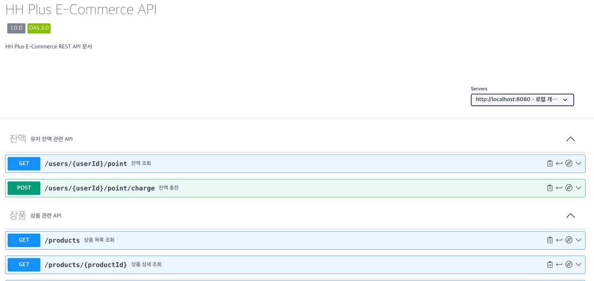

# e-커머스 프로젝트

## 요구사항 문서

[(요구사항 링크)](docs/요구사항.md)

## 마일스톤

[(마일스톤 링크)](https://github.com/users/Moon-Jang/projects/4)

## 시퀀스 다이어그램

[시퀀스 다이어그램 링크](docs/sequence)

## ERD

[(ERD 링크)](docs/erd)

## 스웨거 문서

[(스웨거 링크)](https://app.swaggerhub.com/apis/roby8502/hhplus-ecommerce/1.0.0)

[(스웨거 yaml)](docs/swagger/swagger.yaml)