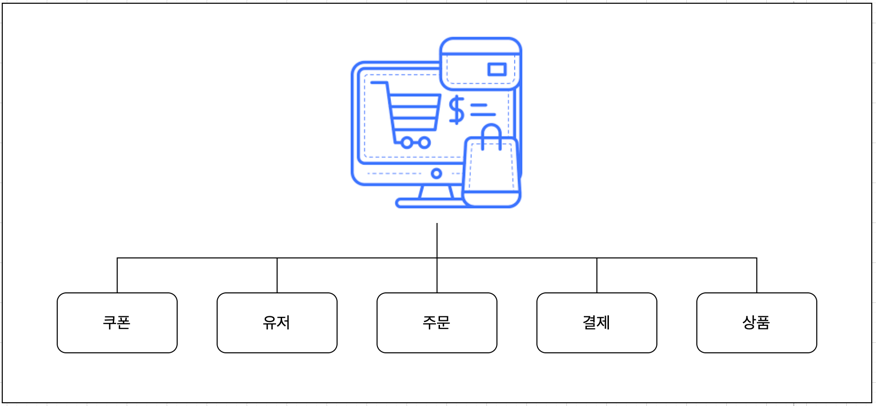
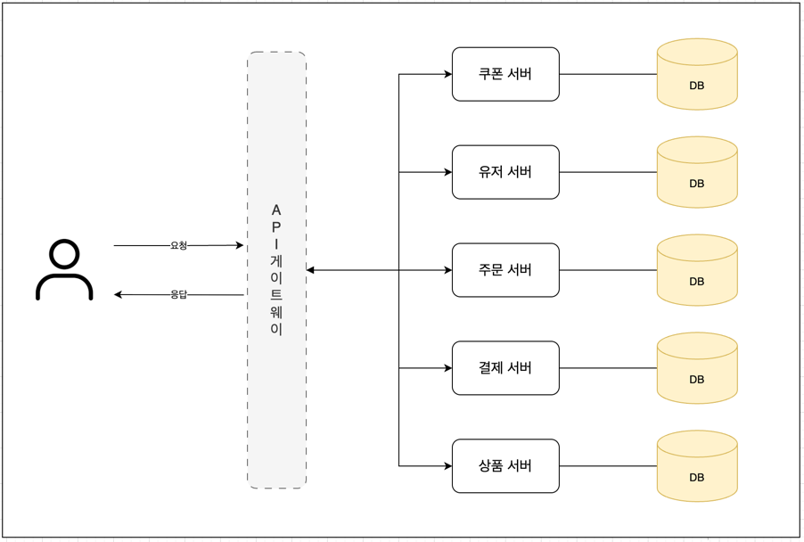

# MSA 기반 분산 서비스 아키텍처 설계 보고서

## 1. 배경

현재 서비스가 지속적으로 성장함에 따라 사용자 수와 트래픽이 급격히 증가하고 있습니다.
이에 따라 기존 모놀리식 아키텍처로는 서비스의 확장성과 유지보수성 측면에서 한계에 도달하였습니다.
특히, 서비스 부하가 집중될 때 성능 저하와 장애가 빈번히 발생하였고, 기능 추가 및 변경 시 전체 애플리케이션의 배포가 요구되는 등의 문제가 있었습니다.

따라서 이러한 한계를 극복하고 지속 가능한 성장을 이루기 위해 독립적이고 확장 가능한 MSA(Microservices Architecture)로의 전환이 필요하다고 판단하였습니다.

## 2. MSA 란?

MSA(Microservices Architecture)는 시스템을 독립적이고 작은 단위의 서비스로 분리하여 구축하는 소프트웨어 아키텍처입니다.
각 서비스는 명확한 비즈니스 기능에 맞춰 설계되며 독립적인 데이터 관리, 배포, 확장, 장애 복구가 가능합니다.
이를 통해 서비스의 빠른 개발과 배포, 높은 확장성 및 유연성을 확보할 수 있습니다.

### MSA와 모놀리틱의 차이

| 항목             | MSA                               | 모놀리틱 아키텍처                   |
| ---------------- | --------------------------------- | ----------------------------------- |
| 아키텍처 구성    | 여러 개의 작은 서비스로 분리      | 하나의 큰 단일 서비스로 구성        |
| 확장성           | 독립적으로 확장 가능              | 전체 서비스 확장 필요               |
| 배포 주기        | 각 서비스 별로 독립적인 배포 가능 | 전체 애플리케이션 배포 필요         |
| 장애 영향 범위   | 서비스 단위로 제한적              | 전체 서비스가 영향을 받음           |
| 유지보수 용이성  | 서비스 단위로 용이                | 변경 시 전체 애플리케이션 점검 필요 |
| 데이터 관리 방식 | 서비스 별 독립적 데이터 관리      | 단일 데이터베이스로 집중 관리       |

## 3. 서비스 분리

서비스를 MSA로 전환하기 위해 다음과 같은 기준으로 서비스를 분리하였습니다.

- **비즈니스 도메인**: 각 서비스는 특정 비즈니스 도메인에 맞춰 설계되었습니다. 예를 들어, 사용자 관리, 상품 관리, 주문 관리 등으로 분리하였습니다.
- **기능적 독립성**: 각 서비스는 독립적으로 기능을 수행할 수 있도록 설계되었습니다. 이를 통해 서비스 간의 의존성을 최소화하였습니다.
- **데이터 독립성**: 각 서비스는 독립적인 데이터베이스를 사용하여 데이터 관리의 독립성을 확보하였습니다. 이를 통해 서비스 간의 데이터 의존성을 최소화하였습니다.

### 분리된 도메인

## 4. MSA 설계

### API 게이트웨이
모든 클라이언트 요청에 대한 단일 진입점 역할을 수행합니다. API 게이트웨이를 통해 인증, 권한 부여, 라우팅, 로드 밸런싱 등의 공통 기능을 처리하여 각 마이크로서비스의 부담을 줄이고 독립성을 강화합니다. 또한, 클라이언트에게 통합된 API를 제공하여 서비스 복잡성을 숨기고 사용 편의성을 높입니다.

### 독립적인 서비스 운영
각 마이크로서비스는 자체적인 배포 단위를 가지며, 독립적인 데이터베이스(DB)를 소유합니다. 이를 통해 서비스 간의 결합도를 낮추고, 특정 서비스의 변경이나 장애가 다른 서비스에 미치는 영향을 최소화합니다. 각 서비스는 독립적으로 개발, 테스트, 배포될 수 있어 개발 생산성과 배포 유연성을 크게 향상시킵니다.

### 오토스케일링
각 마이크로서비스는 독립적으로 인스턴스 확장이 가능합니다. 트래픽 변화나 특정 기능의 부하에 따라 필요한 만큼 자원을 동적으로 할당하고 회수하는 오토스케일링을 통해 비용 효율성을 높이고 안정적인 서비스 운영을 보장합니다.

## 5. 트랜잭션 관리

### MSA와 모놀리틱의 차이

모놀리식 아키텍처에서는 단일 데이터베이스 내에서 ACID 트랜잭션을 통해 데이터 일관성을 비교적 쉽게 보장할 수 있습니다. 하나의 트랜잭션으로 여러 테이블의 데이터를 변경하고, 문제가 발생하면 롤백하여 원자성을 확보합니다.

반면, MSA에서는 각 서비스가 자체 데이터베이스를 소유하므로 여러 서비스에 걸친 트랜잭션을 처리하기 어렵습니다. 단일 ACID 트랜잭션으로 모든 서비스의 데이터 변경을 묶을 수 없기 때문에 분산 트랜잭션 관리가 필수적입니다.

### 분산 트랜잭션 관리의 필요성

여러 마이크로서비스에 걸쳐 있는 비즈니스 로직을 수행할 때, 일부 서비스의 작업은 성공하고 다른 서비스의 작업은 실패하는 상황이 발생할 수 있습니다. 이러한 부분적인 성공/실패는 데이터 불일치를 야기하며, 시스템 전체의 정합성을 해칠 수 있습니다. 따라서 여러 서비스에 걸친 트랜잭션이 하나의 논리적인 단위로 처리되어 모든 작업이 성공하거나, 실패 시 이전 상태로 되돌리는(보상 트랜잭션) 메커니즘이 필요합니다.

### SAGA 패턴

SAGA 패턴은 분산 환경에서 데이터 일관성을 유지하기 위한 트랜잭션 관리 기법입니다. 일련의 로컬 트랜잭션들로 구성되며, 각 로컬 트랜잭션이 완료되면 다음 로컬 트랜잭션을 트리거합니다. 만약 어떤 로컬 트랜잭션이 실패하면, 이전 단계에서 성공했던 트랜잭션들을 취소하는 보상 트랜잭션(Compensating Transaction)을 실행하여 데이터 일관성을 맞춥니다.

SAGA 패턴은 크게 두 가지 방식으로 구현될 수 있습니다.

**1️⃣ 오케스트레이션 (Orchestration)**
오케스트레이션 방식은 중앙 집중형 조정자(Orchestrator)가 전체 트랜잭션 흐름을 관리합니다. 오케스트레이터는 각 서비스에게 수행할 작업을 명령하고, 작업 결과를 받아 다음 단계를 진행하거나 실패 시 보상 트랜잭션을 지시합니다.

- **장점**: 전체 트랜잭션 흐름을 중앙에서 관리하므로 이해하기 쉽고, 복잡한 트랜잭션 관리에 용이합니다.
- **단점**: 오케스트레이터에 대한 의존성이 높아지며, 오케스트레이터 자체가 단일 실패 지점(SPOF)이 될 수 있습니다. 또한 코레오그래피 패턴 대비 이벤트 발행을 상대적으로 많이 요구하게 됩니다. 

**2️⃣ 코레오그래피 (Choreography)**
코레오그래피 방식은 중앙 조정자 없이 각 서비스가 자율적으로 다음 단계를 결정합니다. 각 서비스는 자신의 로컬 트랜잭션을 완료한 후 이벤트를 발행(Publish)하고, 관련된 다른 서비스들이 이 이벤트를 구독(Subscribe)하여 다음 작업을 수행하거나 보상 트랜잭션을 실행합니다.

- **장점**: 서비스 간 결합도가 낮아 유연하고 확장성이 좋습니다. 중앙 조정자가 없어 단일 실패 지점 문제가 없습니다.
- **단점**: 전체 트랜잭션 흐름을 파악하기 어렵고, 서비스 간 의존성이 암묵적으로 형성되어 디버깅 및 테스트가 복잡해질 수 있습니다. 서비스 수가 많아지면 이벤트 흐름 관리가 어려워질 수 있습니다.

## 6. 마치며
MSA로 전환함에 따라 서비스의 확장성과 유지보수성이 크게 향상되었습니다. 각 서비스는 독립적으로 개발, 배포, 운영될 수 있어 비즈니스 요구에 빠르게 대응할 수 있습니다.
또한, 오토스케일링을 통해 트래픽 변화에 유연하게 대응할 수 있으며, SAGA 패턴을 통해 분산 트랜잭션 관리의 복잡성을 해결하였습니다.
