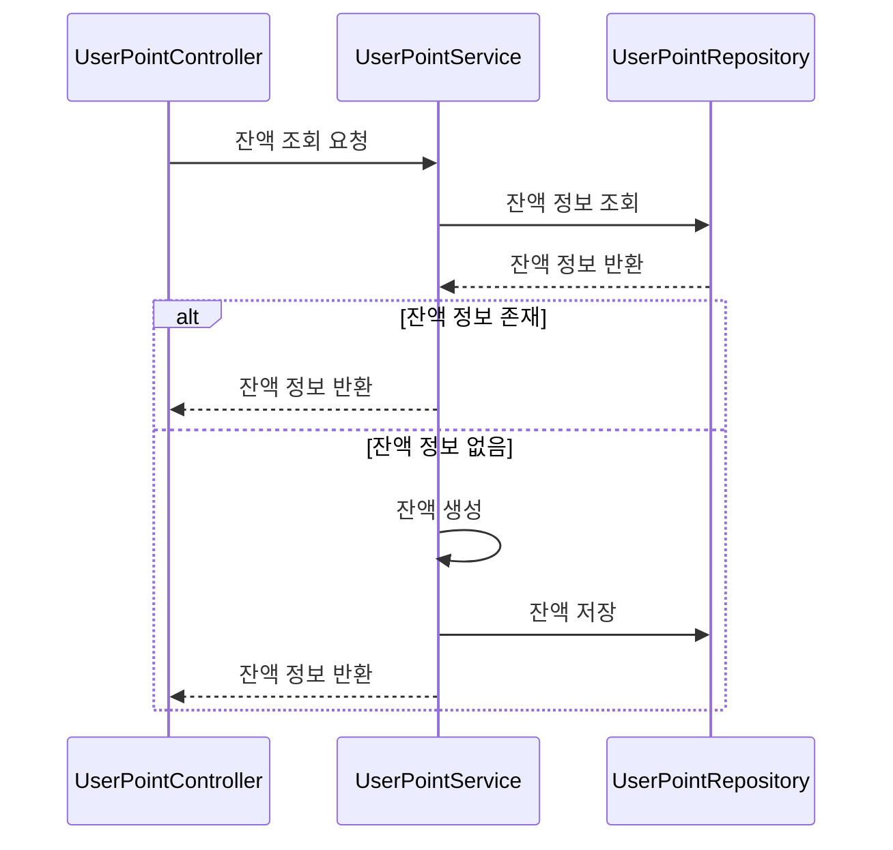

```mermaid
sequenceDiagram
    participant UserPointController
    participant UserPointService
    participant UserPointRepository

    UserPointController->>UserPointService: 잔액 조회 요청

    UserPointService->>UserPointRepository: 잔액 정보 조회
    UserPointRepository-->>UserPointService: 잔액 정보 반환

    alt 잔액 정보 존재
        UserPointService-->>UserPointController: 잔액 정보 반환
    else 잔액 정보 없음
        UserPointService->>UserPointService: 잔액 생성
        UserPointService->>UserPointRepository: 잔액 저장
        UserPointService-->>UserPointController: 잔액 정보 반환
    end
```
