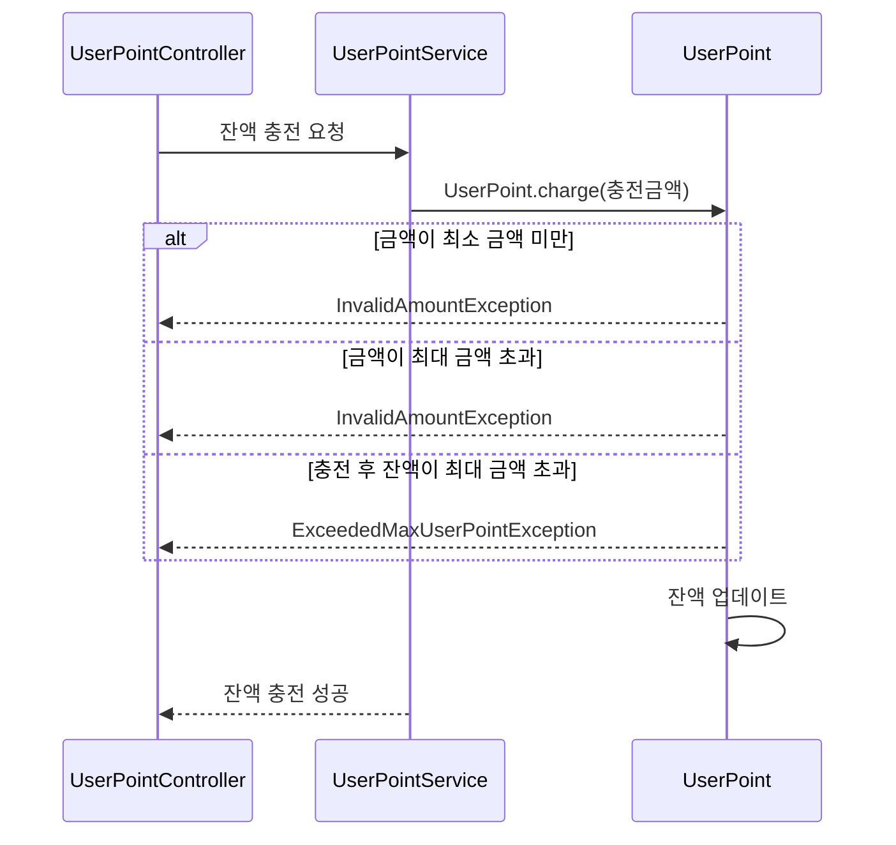

```mermaid
sequenceDiagram
    participant UserPointController
    participant UserPointService
    participant UserPoint

    UserPointController->>UserPointService: 잔액 충전 요청

    UserPointService->>UserPoint: UserPoint.charge(충전금액)

    alt 금액이 최소 금액 미만
        UserPoint-->>UserPointController: InvalidAmountException
    else 금액이 최대 금액 초과
        UserPoint-->>UserPointController: InvalidAmountException
    else 충전 후 잔액이 최대 금액 초과
        UserPoint-->>UserPointController: ExceededMaxUserPointException
    end

    UserPoint->>UserPoint: 잔액 업데이트
    UserPointService-->>UserPointController: 잔액 충전 성공
```
