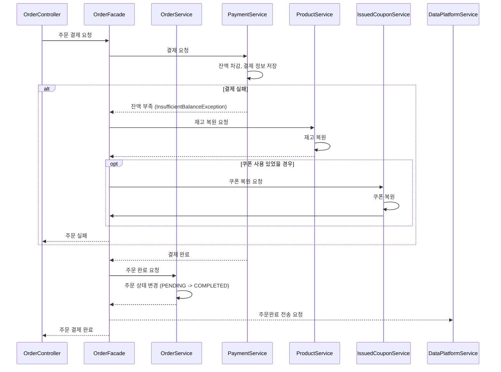

```mermaid
sequenceDiagram
    participant OrderController
    participant OrderFacade
    participant OrderService
    participant PaymentService
    participant ProductService
    participant IssuedCouponService
    participant DataPlatformService

    OrderController->>OrderFacade: 주문 결제 요청

    OrderFacade->>PaymentService: 결제 요청
    PaymentService->>PaymentService: 잔액 차감, 결제 정보 저장
    
    alt 결제 실패
        PaymentService-->>OrderFacade: 잔액 부족 (InsufficientBalanceException)
    
        OrderFacade->>ProductService: 재고 복원 요청
        ProductService->>ProductService: 재고 복원
        ProductService-->>OrderFacade: 
        
        opt 쿠폰 사용 있었을 경우
            OrderFacade->>IssuedCouponService: 쿠폰 복원 요청
            IssuedCouponService->>IssuedCouponService: 쿠폰 복원
            IssuedCouponService->>OrderFacade: 
        end
    
        OrderFacade-->>OrderController: 주문 실패
    end
    PaymentService-->>OrderFacade: 결제 완료

    OrderFacade->>OrderService: 주문 완료 요청
    OrderService->>OrderService: 주문 상태 변경 (PENDING -> COMPLETED)
    OrderService-->>OrderFacade: 
    
    OrderFacade-->>DataPlatformService: 주문완료 전송 요청
OrderFacade-->>OrderController: 주문 결제 완료
```
