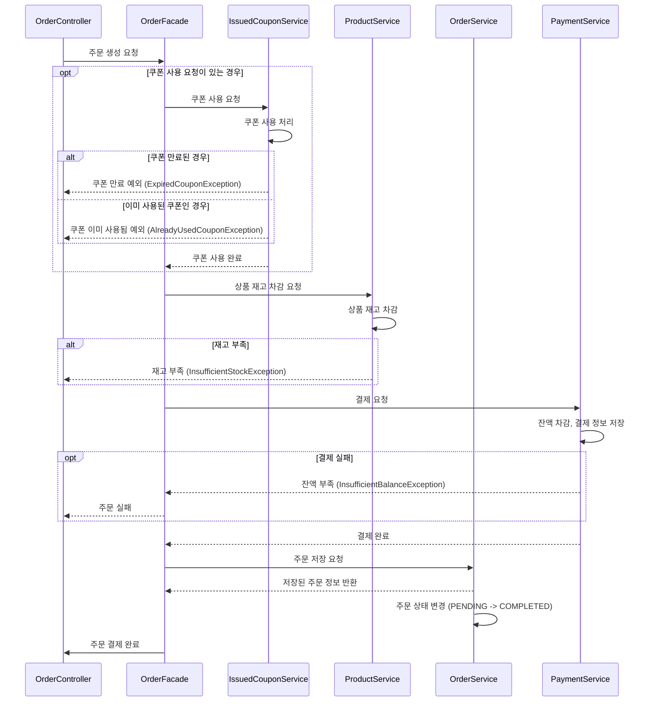

```mermaid
sequenceDiagram
    participant OrderController
    participant OrderFacade
    participant IssuedCouponService
    participant ProductService
    participant OrderService

    OrderController->>OrderFacade: 주문 생성 요청

    opt 쿠폰 사용 요청이 있는 경우
        OrderFacade->>IssuedCouponService: 쿠폰 사용 요청
        IssuedCouponService->>IssuedCouponService: 쿠폰 사용 처리

        alt 쿠폰 만료된 경우
            IssuedCouponService-->>OrderController: 쿠폰 만료 예외 (ExpiredCouponException)
        else 이미 사용된 쿠폰인 경우
            IssuedCouponService-->>OrderController: 쿠폰 이미 사용됨 예외 (AlreadyUsedCouponException)
        end
        IssuedCouponService-->>OrderFacade: 쿠폰 사용 완료
    end

    OrderFacade->>ProductService: 상품 재고 차감 요청
    ProductService->>ProductService: 상품 재고 차감

    alt 재고 부족
        ProductService-->>OrderController: 재고 부족 (InsufficientStockException)
    end

    OrderFacade->>PaymentService: 결제 요청
    PaymentService->>PaymentService: 잔액 차감, 결제 정보 저장
    
    opt 결제 실패
        PaymentService-->>OrderFacade: 잔액 부족 (InsufficientBalanceException)
        OrderFacade-->>OrderController: 주문 실패
    end
    
    PaymentService-->>OrderFacade: 결제 완료
    
    OrderFacade->>OrderService: 주문 저장 요청
    OrderService-->>OrderFacade: 저장된 주문 정보 반환
    OrderService->>OrderService: 주문 상태 변경 (PENDING -> COMPLETED)
    OrderFacade->>OrderController: 주문 결제 완료
```
