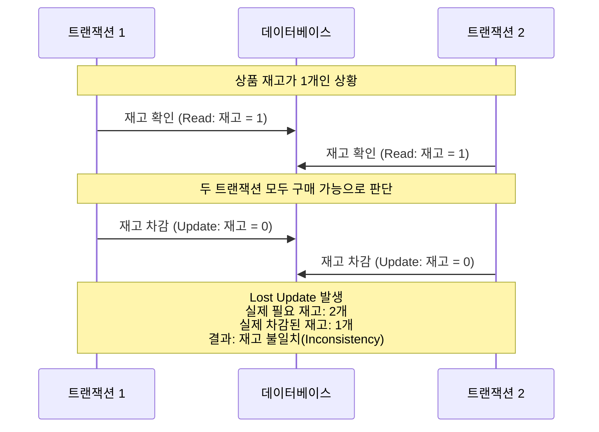
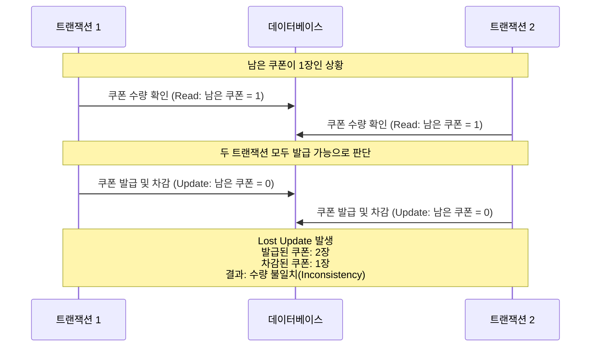
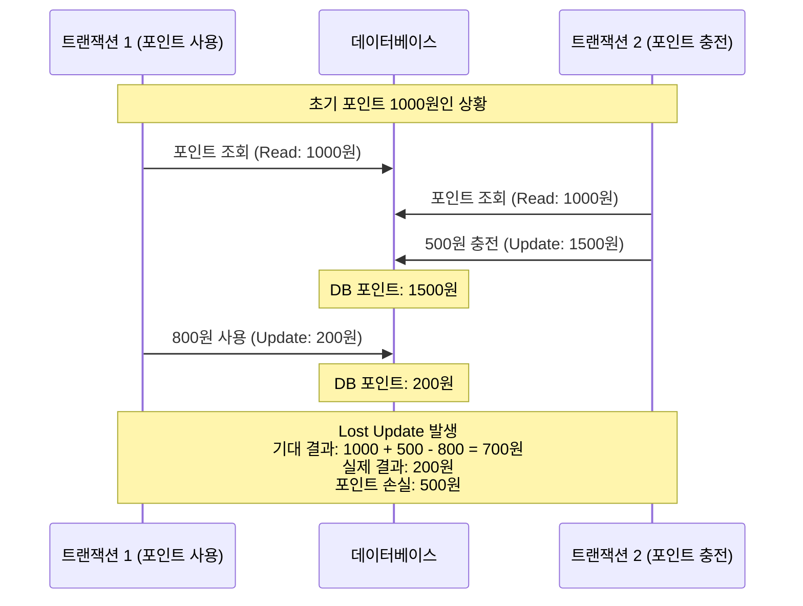
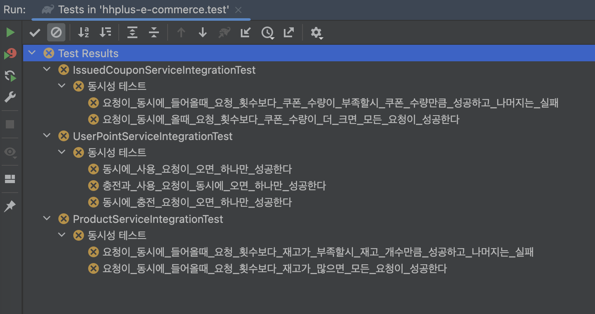
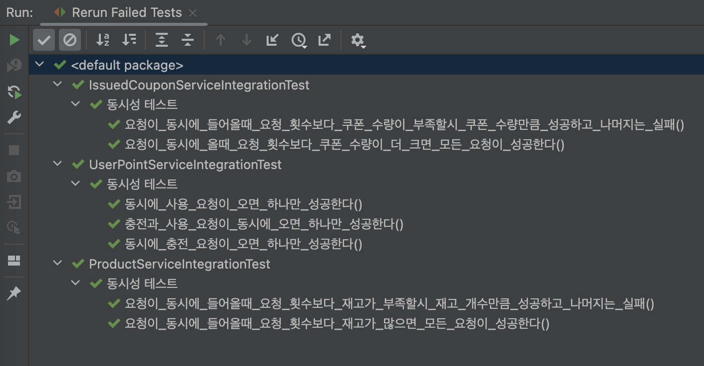

# 동시성 제어 방안 보고서

## 1. 배경

현재 서비스내에 **재고 차감, 선착순 쿠폰 발급** 시 동시성 문제가 발생하고 있습니다. 이는 **데이터 불일치**와 **사용자 경험 저하**를 유발하며, **고객 신뢰도 하락** 및 **잠재적 손실**로 이어질 수 있습니다.

본 보고서는 이러한 동시성 문제의 원인을 분석하고, 안정적인 서비스 운영을 위한 효과적인 제어 방안을 제시하고자 합니다.

## 2. 문제 식별 및 분석

### 2.1. 동시성 문제 발생 원인

애플리케이션 레벨의 동시성 문제는 주로 여러 트랜잭션이 공유 자원에 대해 **읽기 후 쓰기(Read-Update)** 작업을 경쟁적으로 수행할 때 발생합니다. 데이터를 읽어 상태를 확인한 후 변경하는 로직이 동시에 실행되면, 데이터 불일치가 발생할 수 있습니다.

동시성 제어가 미흡하면 다음과 같은 문제가 발생할 수 있습니다.
-   **분실 갱신 (Lost Update)**: 여러 트랜잭션이 동시에 동일 데이터를 수정할 때, 마지막 커밋된 트랜잭션의 결과만 남고 이전 수정 내용은 사라지는 현상
-   **데이터 불일치 (Inconsistency)**: 동시 작업으로 인해 데이터가 논리적으로 맞지 않는 상태가 되는 현상 (예: 재고가 음수가 됨)
-   이 외에도 트랜잭션 격리 수준에 따라 Dirty Read, Non-repeatable Read, Phantom Read 등이 발생 가능합니다.

### 2.2. 기능별 분석

#### 1️⃣ **재고 차감 처리**:

- **동시성 이슈 발생 상황**

- **설명**: 여러 사용자가 동시에 마지막 남은 재고를 확인하고 각자 재고 차감을 시도하면, 실제 재고 이상으로 주문이 처리되거나(Inconsistency), 먼저 시도한 트랜잭션의 변경 사항이 누락(Lost Update)될 수 있습니다.

#### 2️⃣ **선착순 쿠폰 발급**:

- **동시성 이슈 발생 상황**

- **설명**: 발급 마감 직전, 여러 사용자가 동시에 남은 쿠폰 수량을 확인하고 발급을 시도하면, 제한된 수량보다 많은 쿠폰이 발급되거나(Inconsistency), 쿠폰 수량 차감 시 Lost Update가 발생할 수 있습니다.

#### 3️⃣ **유저 포인트 관리 (충전/사용)**:

- **동시성 이슈 발생 상황**

- **설명**: 동일 사용자가 여러 경로를 통해 거의 동시에 포인트를 변경할 때, 각 트랜잭션이 이전에 읽은 값을 기준으로 업데이트하면 Lost Update가 발생하여 최종 포인트가 부정확해질 수 있습니다.

## 3. 해결

**데이터베이스 잠금(Locking) 메커니즘, 특히 비관적 락과 낙관적 락을 활용하여 동시성 문제를 해결**합니다. 각 기능의 특성(경합 빈도, 데이터 정합성 중요도)에 맞춰 적절한 잠금 방식을 선택합니다.

- **비관적 락(Pessimistic Lock)**:
  - 데이터 경합이 잦을 것으로 예상될 때 사용합니다.
  - 데이터 조회 시점에 배타적 잠금(Exclusive Lock)을 설정하여 다른 트랜잭션의 수정을 차단합니다.
  - 데이터 정합성을 강력하게 보장하지만, 잠금 대기로 인해 성능 저하가 발생할 수 있습니다.
  - 주로 `SELECT ... FOR UPDATE` 구문을 사용합니다.
- **낙관적 락(Optimistic Lock)**:
  - 데이터 경합이 드물 것으로 예상될 때 사용합니다.
  - 잠금 없이 데이터를 읽고, 수정 시점에 데이터 변경 여부를 확인합니다.
  - 일반적으로 `version` 컬럼을 사용하여 구현하며, 수정 시 버전을 확인하고 증가시킵니다. 버전이 일치하지 않으면 충돌로 간주하고 롤백 또는 재시도를 수행합니다.
  - 잠금 오버헤드가 적어 성능에 유리하지만, 충돌 처리 로직이 필요합니다.

### 3.1. 기능별 제어 방식 결정 및 사유

#### 1️⃣ **재고 차감 (비관적 락)**

- **선택 사유**: 재고는 **경합 빈도가 매우 높고**, 재고 이상의 판매는 **치명적인 오류**입니다. 데이터 불일치를 방지하고 **데이터 정합성을 최우선으로 보장**하기 위해 비관적 락을 적용합니다.
- **구현 예시**: `SELECT * FROM product_options WHERE id = ? FOR UPDATE` 쿼리로 재고를 조회하고 잠급니다. 이후 재고 차감 시점에 업데이트를 수행합니다.

#### 2️⃣ **선착순 쿠폰 발급 (비관적 락)**

- **선택 사유**: 쿠폰 역시 **경합 빈도가 높고**, **정해진 수량 초과 발급을 엄격히 막아야 합니다**. 재고 차감과 마찬가지로 **데이터 정합성이 매우 중요**하므로, 비관적 락을 적용하여 데이터 정합성을 확보합니다.
- **구현 예시**: `SELECT * FROM coupons WHERE id = ? FOR UPDATE` 쿼리로 쿠폰 수량을 조회하고 잠급니다. 이후 쿠폰 발급 시점에 업데이트를 수행합니다.

#### 3️⃣ **유저 포인트 관리 (낙관적 락)**

- **선택 사유**: 특정 사용자 포인트는 주로 해당 사용자 관련 트랜잭션에서만 변경되어 **동시 변경 가능성이 상대적으로 낮습니다**. **충돌 빈도가 낮을 것으로 예상**되므로, 낙관적 락을 적용하여 **성능 저하를 최소화**합니다.
- **구현 예시**: `UPDATE user_points SET points = points - ? WHERE user_id = ? AND version = ?` 쿼리로 포인트를 차감합니다. 이때, `version`을 확인하여 충돌 여부를 판단합니다.

### 3.2 테스트 결과

#### **[AS-IS] 락 적용 전**

#### **[TO-BE] 락 적용 후**

## 4. 한계 및 대안

**제시된 락 기반 해결 방식은 성능 저하, 데드락 가능성(비관적 락), 또는 충돌 시 재시도 처리 복잡성(낙관적 락) 등의 한계점**을 가집니다. 이를 보완하거나 대체할 수 있는 다른 기술적 접근법도 고려할 수 있습니다.

### 4.1. 제안 방식의 한계점

- **비관적 락(Pessimistic Lock)**:
  - **성능 저하**: 데이터 잠금으로 인한 트랜잭션 대기는 시스템 전체 처리량(Throughput) 감소를 유발할 수 있습니다.
  - **데드락 가능성**: 여러 트랜잭션이 서로 다른 자원을 잠그고 대기하면 교착 상태(Deadlock)에 빠질 수 있습니다.
- **낙관적 락(Optimistic Lock)**:
  - **높은 경합 시 성능 저하**: 충돌이 빈번하면 반복적인 재시도로 인해 오히려 비관적 락보다 성능이 저하될 수 있습니다.
  - **복잡성 증가**: 버전 관리 및 충돌 처리 로직을 애플리케이션에 구현해야 합니다.
  - **스키마 변경**: 버전 관리를 위한 추가 컬럼(예: `version`)이 필요합니다.

### 4.2. 고려 가능한 대안

- **Application Level Lock**: Redis(`SETNX`)나 Redisson 같은 분산 락 라이브러리를 사용해 애플리케이션 레벨에서 잠금을 관리합니다. DB 부하를 줄이고 분산 환경에 유용하지만, 별도 시스템 의존성 및 관리 포인트가 증가합니다.
- **Message Queue 활용**: 요청을 메시지 큐(예: Kafka, RabbitMQ)에 보내 순차적으로 처리합니다. 직접적인 DB 경합을 피하고 처리량을 높일 수 있지만, 최종 일관성(Eventual Consistency) 모델이므로 즉각적인 결과 확인이 어려울 수 있습니다.
- **Atomic 연산 활용**: DB가 지원하는 원자적 연산을 사용합니다. (예: `UPDATE product_options SET stock = stock - 1 WHERE id = ? AND stock > 0`). 조건부 업데이트로 데이터 정합성을 일부 보장할 수 있지만, 복잡한 로직 구현에는 한계가 있습니다.

이러한 대안들은 각각 장단점이 있으므로, 문제 특성, 시스템 아키텍처, 성능 요구사항 등을 종합적으로 고려하여 최적의 방식을 선택하거나 조합해야 합니다.
