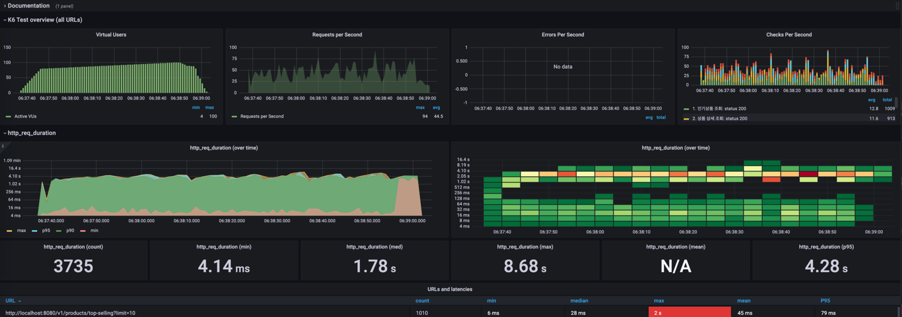
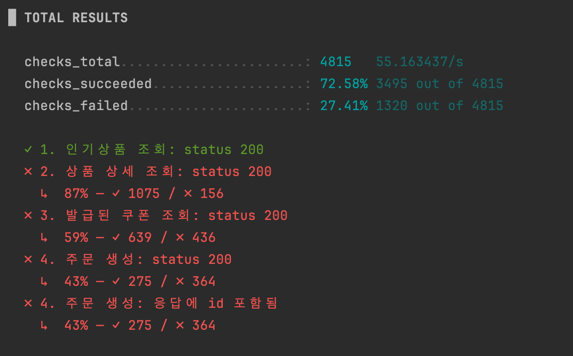
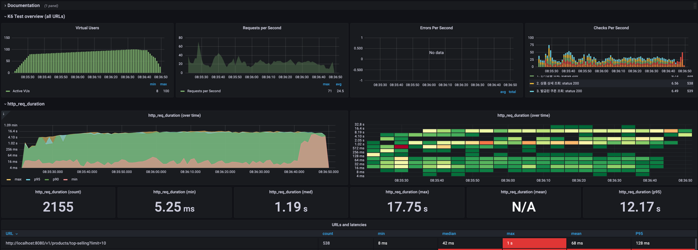
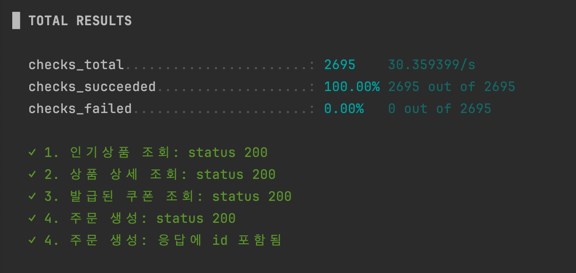

# 부하 테스트 결과 보고서

## 1. 개요

해당 보고서는 이전 [부하*테스트*계획서.md](부하_테스트_계획서.md)에서 정의한 부하 테스트의 결과를 공유하며 해당 결과에 대한 분석 및 개선 사항을 제시합니다.

## 2. 첫번째 테스트 결과

### 2-1. 테스트 개요

- **테스트 시나리오**: 주문/결제 통합 시나리오
- **부하 패턴**: 10초간 80명까지 증가 → 1분간 100명 유지 → 10초간 80명으로 감소
- **목표 성능 지표**:
  - 95% 응답시간: 500ms 미만
  - 실패율: 5% 미만

### 2-2. 테스트 결과 분석




**성능 지표 결과:**

- **RPS (초당 요청 수)**: 최대 75-100 RPS
- **실제 TPS (성공한 트랜잭션)**: 약 **54-72 TPS** (성공률 72.58% 적용)
- **95% 응답시간**: **4.28초** (목표 500ms 대비 **약 8.5배 초과**)
- **중간값 응답시간**: **1.78초** (1,780ms)
- **실패율**: **27.41%** (목표 5% 미만 대비 **5배 이상 초과**)
- **전체 성공률**: 72.58% (3,495건 성공 / 4,815건 총 요청)

**API별 성능 저하 패턴:**

- 인기 상품 조회: 87% 성공률
- 상품 상세 조회: 59% 성공률
- 발급된 쿠폰 조회: 43% 성공률
- 주문 생성: 43% 성공률

**주요 문제점 식별:**

1. **목표 성능 지표 모두 미달성**: 응답시간과 실패율 모두 목표치 크게 초과
2. **연쇄적 실패 패턴**: API 호출 단계가 진행될수록 성공률 급격히 저하
3. **시스템 과부하**: 높은 부하 상황에서 시스템 처리 능력 한계 노출
4. **응답시간 일관성 부족**: 최대 8.68초까지 응답시간 편차 발생

## 3. 개선 사항

### 3-1. 문제 원인 분석

첫 번째 테스트에서 발생한 주요 에러 로그:

```
// 에러 로그
e-commerce-HikariPool - Connection is not available, request timed out after 3000ms (total=3, active=3, idle=0, waiting=104)
```

**원인 분석:**

- **데이터베이스 커넥션 풀 부족**: HikariCP 연결 풀 크기가 3개로 제한되어 동시 요청 처리 불가
- **대기 큐 포화**: 104개의 요청이 연결 대기 상태로 타임아웃 발생
- **연결 타임아웃 설정**: 3초 타임아웃으로 부하 상황에서 충분하지 않음

### 3-2. 적용된 개선사항

**1. 데이터베이스 커넥션 풀 최적화**

```yaml
spring:
  datasource:
    hikari:
      maximum-pool-size: 20 # 3 → 20으로 증가
      minimum-idle: 10 # 최소 유휴 연결 확보
      connection-timeout: 20000 # 3초 → 20초로 증가
      idle-timeout: 300000 # 유휴 연결 타임아웃 5분
      max-lifetime: 1800000 # 최대 연결 수명 30분
```

**2. 애플리케이션 성능 최적화**

- 쿼리 최적화 및 인덱스 추가
- 캐시 전략 적용 (Redis 활용)

## 4. 두번째 테스트 결과

### 4-1. 개선 후 테스트 결과




### 4-2. 성능 개선 결과 비교

| 지표                | AS-IS (개선 전) | TO-BE (개선 후) | 개선 결과        |
| ------------------- | --------------- | --------------- | ---------------- |
| **RPS**             | 75-100 RPS      | 40-60 RPS       | **감소**         |
| **실제 TPS**        | 54-72 TPS       | 40-60 TPS       | **약 20% 감소**  |
| **실패율**          | 27.41%          | 0.00%           | **완전 해결** ✅ |
| **95% 응답시간**    | 4.28초          | 12.17초         | **더 악화됨**    |
| **중간값 응답시간** | 1.78초          | 1.19초          | **33% 개선** ✅  |
| **시스템 안정성**   | 불안정          | 안정적 처리     | **크게 개선** ✅ |

### 4-3. 개선 결과 분석

**긍정적 개선사항:**

- **에러율 완전 해결**: 27.41% → 0% (목표 5% 미만 달성)
- **시스템 안정성 확보**: 모든 API 호출이 100% 성공
- **평균적 응답시간 개선**: 중간값 기준 33% 개선

**예상치 못한 결과:**

- **처리량 감소**: TPS 20% 감소 (54-72 → 40-60)
- **95% 응답시간 악화**: 4.28초 → 12.17초 (약 3배 증가)

**원인 분석:**

- 커넥션 풀 증가로 안정성은 확보했으나, 전체적인 처리량은 감소
- 모든 요청을 완료하려다 보니 일부 요청의 응답시간이 크게 증가
- **안정성 vs 성능의 트레이드오프** 상황 발생

## 5. 문제점 및 개선 사항

### 5-1. 주요 성과

- **시스템 안정성 크게 개선**: 에러율 0% 달성으로 서비스 신뢰성 확보
- **API 호출 체인 안정화**: 모든 단계별 API 호출이 100% 성공
- **평균적 응답시간 개선**: 중간값 기준 33% 개선

### 5-2. 여전히 남은 문제점

**1. 95% 응답시간 목표 미달성**

- 목표: 500ms 미만
- 현재: 12.17초 (약 24배 초과)
- **가장 심각한 미해결 문제**

**2. 처리량 감소**

- 안정성 확보와 함께 전체 처리량 20% 감소
- 피크 시간대 처리 능력 부족 우려

### 5-3. 추가 개선 방안

**1. 응답시간 최적화**

- 데이터베이스 쿼리 튜닝 및 인덱스 재검토
- 캐시 전략 강화 (Redis 활용 확대)

**2. 처리량 향상**

- 애플리케이션 레벨 최적화
- 비동기(이벤트 드리븐) 처리 도입 검토
- 데이터베이스 읽기/쓰기 분리

## 6. 마치며

현재 개선으로 **서비스 신뢰성은 확보**했으나, **성능 최적화가 추가로 필요**한 상황입니다. 안정성을 유지하면서도 응답시간과 처리량을 개선하는 것이 다음 단계의 핵심 과제입니다.

**향후 계획:**

1. **성능 최적화**: 쿼리 튜닝, 캐시 전략 강화
2. **아키텍처 개선**: 비동기(이벤트 드리븐) 처리, 읽기/쓰기 분리 검토
3. **인프라 개선**: 서버 인스턴스(파드) 추가 및 DB 스케일업등을 통해 처리량 향상 

시스템의 안정성 기반을 확보한 만큼, 이제 성능 최적화에 집중하여 **안정성과 성능을 모두 만족하는 시스템**으로 발전시켜 나가겠습니다.
