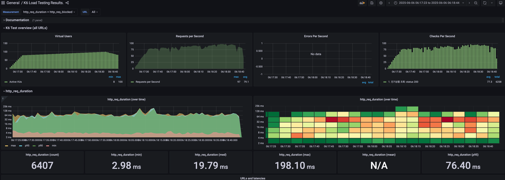

# 부하 테스트 계획서

## 1. 배경

현재 이커머스 플랫폼 개발 마무리 단계이며 실제 운영 환경에 배포되기 전 부하 테스트를 통해 시스템의 성능과 안정성을 검증하고자 합니다.
부하 테스트는 시스템이 예상되는 트래픽을 처리할 수 있는지, 성능 저하 없이 안정적으로 운영될 수 있는지를 확인하는 중요한 과정입니다. 이를 통해 실제 운영 환경에서 발생할 수 있는 문제를 사전에 식별하고 대응 방안을 마련할 수 있습니다.

## 2. 대상 선정

이번 부하 테스트의 대상은 아래와 같은 기준으로 **주문/결제 기능**으로 선정하였습니다.

- **비즈니스 중요도**: E-commerce 플랫폼의 핵심 수익 창출 기능으로, 장애 시 직접적인 매출 손실과 고객 이탈 초래
- **장애 영향도**: 실질적인 비즈니스 손실을 야기하며, 특히 프로모션 기간 중요한 매출 기회 상실
- **기술적 복잡성**: 재고 확인, 결제 연동, 포인트/쿠폰 처리 등 다양한 컴포넌트의 트랜잭션 처리 필요
- **트래픽 특성**: 특정 시간대 급격한 트래픽 증가 발생, 결제 지연/실패 시 고객 경험 직접 악영향

## 3. 테스트 환경

### 3-1. 인프라 구성

| 구분             | 서비스          | 버전         | 포트 | 사양                   |
| ---------------- | --------------- | ------------ | ---- | ---------------------- |
| **애플리케이션** | Spring Boot API | 3.4.1        | 8080 | CPU 2Core, Memory 16GB |
| **데이터베이스** | MySQL           | 8.0          | 3306 | -                      |
|                  | Redis           | 7.4.4-alpine | 6379 | -                      |
| **메시징**       | Kafka           | 3.5.1        | 9092 | Replication factor 3   |

### 3-2. 테스트 데이터

| 데이터 타입  | 생성 스크립트          | 데이터 규모              | 비고                      |
| ------------ | ---------------------- | ------------------------ | ------------------------- |
| **사용자**   | users.py               | 1,000,000명              | 포인트 100만씩 보유       |
| **상품**     | product.py             | 10,000개                 | 옵션 1-3개, 재고 10,000개 |
| **판매통계** | daily_product_stats.py | 50,000건                 | 5일간 상품별 일일통계     |
| **쿠폰**     | coupon.py              | 10,000개 + 2,000,000발급 | 할인액 1,000-10,000원     |

이러한 대용량 데이터 환경에서 실제 운영 상황과 유사한 부하 테스트를 수행할 예정입니다.

## 4. 테스트 도구

### 4-1. 부하 테스트 도구

**K6**를 주요 부하 테스트 도구로 선정하였습니다.

**K6 선정 이유:**

- **JavaScript 기반**: 시나리오 작성이 용이하고 복잡한 테스트 로직 구현 가능
- **가벼운 아키텍처**: Go로 개발되어 높은 성능과 낮은 리소스 사용량
- **풍부한 메트릭**: TPS, 응답시간, 에러율 등 다양한 성능 지표 자동 수집
- **시나리오 유연성**: 단계별 부하 증가, 스파이크 테스트 등 다양한 패턴 지원

### 4-2. 모니터링 및 시각화

**InfluxDB + Grafana** 조합으로 실시간 모니터링 및 시각화를 구성하였습니다.

**InfluxDB (1.8.5)**

- K6 테스트 결과를 실시간으로 수집 및 저장
- 시계열 데이터베이스로 성능 메트릭 최적화
- Port 8086으로 K6와 연동

**Grafana (9.3.8)**

- InfluxDB 데이터를 기반으로 실시간 대시보드 구성
- TPS, 응답시간, 에러율, 시스템 리소스 사용률 시각화
- Port 3000으로 웹 기반 모니터링 제공
- 테스트 진행 중 실시간 성능 지표 확인 가능

이를 통해 테스트 실행 중 실시간으로 성능 지표를 모니터링하고, 시스템 임계점을 즉시 파악할 수 있습니다.

## 5. 테스트 시나리오

### 5-1. 주문/결제 통합 시나리오

실제 사용자의 구매 여정을 시뮬레이션하는 **End-to-End 테스트 시나리오**를 구현하였습니다.

**부하 패턴:**

- 10초간 80명까지 증가
- 1분간 100명 유지 (피크 부하)
- 10초간 80명으로 감소

**성능 임계값:**

- 95% 응답시간: 500ms 미만
- 실패율: 5% 미만

**테스트 시나리오 단계:**

1. **랜덤 유저 선택**: 1~1,000,000 중 랜덤 사용자 ID 생성
2. **인기 상품 조회**: 상위 10개 인기 상품 목록 조회
3. **상품 선택**: 인기 상품 중 랜덤으로 1개 선택
4. **상품 상세 조회**: 선택된 상품의 옵션 정보 포함 상세 조회
5. **쿠폰 조회**: 해당 사용자의 발급된 쿠폰 목록 조회
6. **주문 생성**: 상품 옵션 + 쿠폰 적용하여 주문 생성

### 5-2. K6 테스트 코드

```javascript
import http from 'k6/http';
import { sleep, check, fail } from 'k6';

const HOST = 'http://localhost:8080';

export let options = {
    stages: [
        {duration: '10s', target: 80},
        {duration: '1m', target: 100},
        {duration: '10s', target: 80},
    ],
    thresholds: {
        http_req_duration: ['p(95)<500'],
        http_req_failed: ['rate<0.05'],
    },
};

export default function() {
    // 1. 매 반복마다 1 ~ 1,000,000 사이의 랜덤 유저 ID 생성
    const userId = Math.floor(Math.random() * 1_000_000) + 1;

    // 2. 인기 상품 조회
    const topProducts = getTopSellingProducts(10);
    if (!Array.isArray(topProducts) || topProducts.length === 0) {
        sleep(1)
        return;
    }

    // 3. 인기 상품 중 랜덤으로 하나 선택
    const randomIndex = Math.floor(Math.random() * topProducts.length);
    const randomProduct = topProducts[randomIndex];
    const productId = randomProduct.id;

    // 4. 상품 상세 조회 (옵션 정보 포함)
    const productDetails = getProductDetails(productId);
    if (!productDetails) {
        sleep(1)
        return;
    }

    // 5. 상세 조회 결과에서 옵션 ID 추출 (첫 번째 옵션 선택)
    let productOptionId = null;
    if (Array.isArray(productDetails.options) && productDetails.options.length > 0) {
        productOptionId = productDetails.options[0].id;
    }
    if (productOptionId === null) {
        sleep(1)
        return;
    }

    // 6. 해당 랜덤 유저의 발급된 쿠폰 목록 조회
    const issuedCoupons = getIssuedCoupons(userId);
    let couponIdToUse = null;
    if (Array.isArray(issuedCoupons) && issuedCoupons.length > 0) {
        couponIdToUse = issuedCoupons[0].id;
    }

    // 7. 주문 생성
    createOrder(userId, productOptionId, couponIdToUse);
    sleep(1)
}
..
...
// 실제 구현 함수는 소스 참고 바람
```
