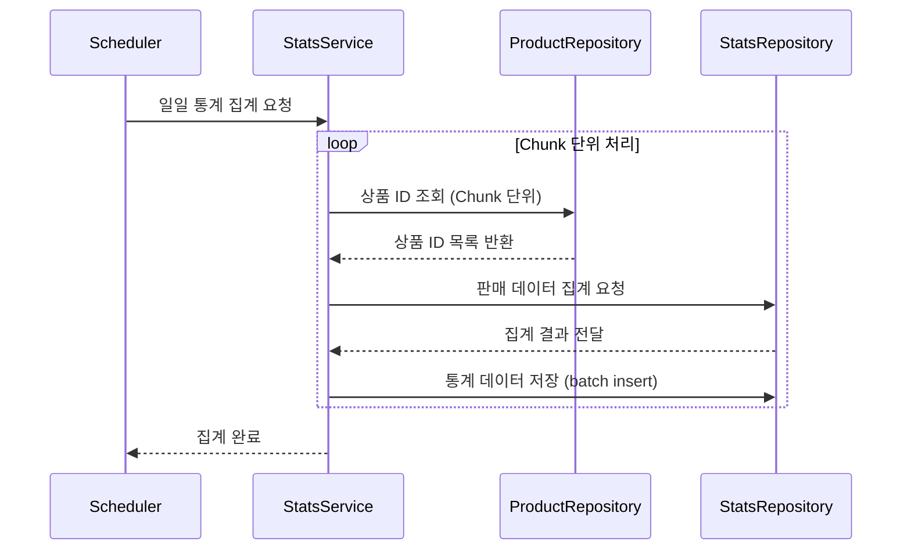

# 서비스 내 병목현상 개선 보고서

## 1) 서론

병목현상이란 시스템 내에서 특정 단계가 전체 처리 속도를 제약해 주된 작업 흐름을 저해하는 현상을 말합니다. 본 보고서에서는 서비스 전반에 걸친 조회 기능 중 특히 **인기 상품 조회**에서 심각하게 나타나는 병목 현상과 그로인한 성능 저하의 원인을 규명하고, 이를 해결하기 위한 방안을 제시하고자 합니다.

## 2) 서비스 내 조회 기능 리스트업

서비스 내 주요 조회 기능과 병목 발생 여부는 다음과 같습니다:

| 기능               | 병목 여부 | 설명                                                                                                                                                         |
| ------------------ | --------- | ------------------------------------------------------------------------------------------------------------------------------------------------------------ |
| 상품 목록 조회     | X         | 검색 조건 없이 단순 목록을 조회하는 기능으로 페이징 처리시 오프셋이 작다면 PK에 적용된 클러스터형 인덱스로 인해 병목 발생하지 않음                           |
| 상품 상세 조회     | X         | 상품 ID로 단일 조회하는 기능으로 PK로 조회하기 때문에 인덱스가 적용되어 있어 병목 발생하지 않음                                                              |
| 쿠폰 목록 조회     | X         | 검색 조건 없이 단순 목록을 조회하는 기능으로 페이징 처리시 오프셋이 작다면 PK에 적용된 클러스터형 인덱스로 인해 병목 발생하지 않음                           |
| **인기 상품 조회** | **O**     | 최근 한 달간 주문된 상품을 기준으로 집계 및 정렬을 수행하여 인기 상품을 조회하는 기능으로, 대량의 데이터를 처리하며 임시 테이블과 정렬이 발생하여 병목 발생 |

## 3) 병목 쿼리 분석

#### 기존 쿼리 (병목 발생)

인기 상품 조회 시 사용되던 기존 쿼리는 다음과 같습니다:

```sql
-- 최근 1개월간 가장 많이 팔린 상품 상위 5개 조회
SELECT po.product_id
FROM orders o
JOIN order_items oi ON oi.order_id = o.id
JOIN product_options po ON po.id = oi.product_option_id
WHERE o.status = 'COMPLETED'
  AND o.created_at > NOW() - INTERVAL 1 MONTH
GROUP BY po.product_id
ORDER BY COUNT(*) DESC
LIMIT 5;
```

#### EXPLAIN ANALYZE 결과 (기존 쿼리)

```sql
-> Limit: 5 row(s)  (actual time=2542..2542 rows=5 loops=1)
  -> Sort: `COUNT(*)` DESC, limit input to 5 row(s) per chunk  (actual time=2542..2542 rows=5 loops=1)
    -> Table scan on <temporary>  (actual time=2541..2541 rows=6394 loops=1)
      -> Aggregate using temporary table  (actual time=2541..2541 rows=6394 loops=1)
        -> Nested loop inner join  (cost=182866 rows=74694) (actual time=442..2382 rows=490650 loops=1)
          -> Nested loop inner join  (cost=156723 rows=74694) (actual time=442..1829 rows=490650 loops=1)
            -> Filter: ((o.`status` = 'COMPLETED') and (o.created_at > <cache>((now() - interval 1 month))))  (cost=102430 rows=49745) (actual time=442..735 rows=327088 loops=1)
              -> Table scan on o  (cost=102430 rows=994896) (actual time=4.42..571 rows=1e+6 loops=1)
            -> Index lookup on oi using order_items_order_id_index (order_id=o.id)  (cost=0.941 rows=1.5) (actual time=0.00292..0.0032 rows=1.5 loops=327088)
          -> Single-row index lookup on po using PRIMARY (id=oi.product_option_id)  (cost=0.25 rows=1) (actual time=0.00098..0.001 rows=1 loops=490650)
```

#### 분석 결과

- **대규모 데이터 스캔**: 총 주문 약 100만 건 중 최근 한 달 주문이 약 50만 건을 차지하여 `orders` 테이블 풀 스캔에 가까운 작업 발생
- **인덱스 비효율**: 최근 한달 주문이 약 50만건을 차지 하여 `created_at` 조건의 필터링 효과가 미미하여 인덱스를 효과적으로 활용하지 못함
- **임시 테이블 사용**: 집계 과정에서 임시 테이블을 사용하여 추가적인 I/O 및 처리 시간 발생
- **실행 시간**: 약 2.5초 소요되어 사용자 경험 저하

## 4) 해결 방안 모색

#### 대안 1: 캐싱

- **내용**: Redis와 같은 인메모리 캐싱을 활용하여 병목 쿼리 결과를 저장하고 재사용
- **결과**: 현재 외부 인프라 사용 제약으로 적용 불가하며 근본적으로 슬로우 쿼리에 대한 개선안이 아님

#### 대안 2: 통계 테이블 (선택)

- **내용**: 매일 자정에 배치 작업을 통해 일별 상품 판매 데이터를 집계하여 별도의 통계 테이블(`daily_product_sales`)에 저장. 조회 시에는 이 통계 테이블만 사용
- **장점**: 외부 인프라 없이 구현 가능, 조회 시 복잡한 조인 및 실시간 집계 제거 (조회 성능 개선)
- **단점**: 집계 시간 동안 쓰기 부하 발생, 데이터 지연 발생(실시간 X)

#### 통계 테이블 구조 (DDL)

선택된 방안에 따라 설계된 통계 테이블 구조는 다음과 같습니다:

```sql
CREATE TABLE daily_product_sales (
    id BIGINT AUTO_INCREMENT COMMENT '일일 통계 ID' PRIMARY KEY,
    aggregation_date DATE NOT NULL COMMENT '집계 날짜',
    product_id BIGINT NOT NULL COMMENT '상품 ID',
    order_count INT DEFAULT 0 NOT NULL COMMENT '완료된 주문 수',
    created_at TIMESTAMP DEFAULT CURRENT_TIMESTAMP NOT NULL COMMENT '생성 시간',
    updated_at TIMESTAMP DEFAULT CURRENT_TIMESTAMP NOT NULL ON UPDATE CURRENT_TIMESTAMP COMMENT '수정 시간',
    UNIQUE KEY uk_daily_product_sales_aggregation_date_product_id (aggregation_date, product_id),
    INDEX dps_covering_index (aggregation_date, product_id, order_count) -- 커버링 인덱스
) COMMENT='일일 상품 판매 통계 테이블';
```

## 5) 설계 및 구현

#### 집계 프로세스 (시퀀스 다이어그램)



#### 구현 상세

배치 작업을 통한 통계 테이블 기반 접근법을 다음과 같이 구현했습니다:

1.  **스케줄러 구성**: Spring의 `@Scheduled` 어노테이션과 `ShedLock`을 사용하여 매일 자정 안정적으로 실행되는 스케줄러 구성
2.  **메모리 효율성**: 전체 상품을 1,000개 단위 청크로 분할 처리하여 메모리 사용량 최적화
3.  **성능 최적화**: `JdbcTemplate`을 활용한 배치 INSERT로 쓰기 성능 확보. 커버링 인덱스 설계로 조회 성능 극대화
4.  **통계 데이터 조회**: 인기 상품 조회 시, 집계된 통계 테이블에서 `orderCount` 합계 기준 상위 상품 ID를 조회하고, 이 ID 목록으로 실제 상품 정보 조회

`ShedLock`란? 다중 인스턴스 환경에서 스케줄러가 중복 실행되지 않도록 Lock을 관리하는 라이브러리입니다. 이를 통해 안정적인 배치 작업을 보장합니다.

## 6) 결과

#### 개선된 쿼리

```sql
-- 통계 테이블에서 최근 1개월간 판매량 상위 5개 상품 ID 조회
SELECT product_id
FROM daily_product_sales
WHERE aggregation_date > NOW() - INTERVAL 1 MONTH
GROUP BY product_id
ORDER BY SUM(order_count) DESC
LIMIT 5;
```

#### EXPLAIN ANALYZE 결과 (개선된 쿼리)

```sql
-> Limit: 5 row(s)  (actual time=108..108 rows=5 loops=1)
  -> Sort: total_cnt DESC, limit input to 5 row(s) per chunk  (actual time=108..108 rows=5 loops=1)
    -> Table scan on <temporary>  (actual time=107..108 rows=6394 loops=1)
      -> Aggregate using temporary table  (actual time=107..107 rows=6394 loops=1)
        -> Filter: (daily_product_sales.aggregation_date > <cache>((now() - interval 1 month)))  (cost=61436 rows=302932) (actual time=0.892..55.8 rows=226647 loops=1)
          -> Covering index range scan on daily_product_sales using dps_covering_index over ('2025-03-17' < aggregation_date)  (cost=61436 rows=302932) (actual time=0.876..41.8 rows=226647 loops=1)
```

#### 성능 비교

| 구분             | 기존 방식             | 개선 방식                    | 개선율  |
| :--------------- | :-------------------- | :--------------------------- | :------ |
| **처리 시간**    | **약 2500ms**         | **약 100ms**                 | **95%** |
| 데이터 조회 방식 | 직접 주문 테이블 조인 | 사전 집계된 통계 테이블 조회 | -       |
| 인덱스 활용      | 비효율적              | 커버링 인덱스 활용           | -       |
| 부하 발생        | 실시간 집계 쿼리      | 미리 집계된 데이터 조회      | -       |
| 메모리 사용량    | 높음                  | 낮음                         | -       |

**분석**: 통계 테이블과 커버링 인덱스 사용으로 테이블 스캔 범위와 처리 데이터 양이 크게 줄었으며, 복잡한 조인과 실시간 집계가 사라져 처리 시간이 95% 단축되었습니다.

## 7) 마치며

통계 테이블을 활용한 일일 배치 집계 방식은 **인기 상품 조회 기능의 병목 현상을 효과적으로 해결**했습니다. 이 방식은 외부 인프라 의존 없이 Spring Boot의 내장 기능만으로 구현 가능하며, 데이터 증가에도 안정적인 성능을 제공합니다.

향후 서비스 확장 및 트래픽 증가 시, Redis 등 인메모리 캐싱을 추가로 도입, Spring Batch와 같은 배치 처리 프레임워크를 활용하여 대량 데이터 처리 및 성능 최적화를 진행하면 더욱 효율적인 시스템을 구축할 수 있을 것입니다.
