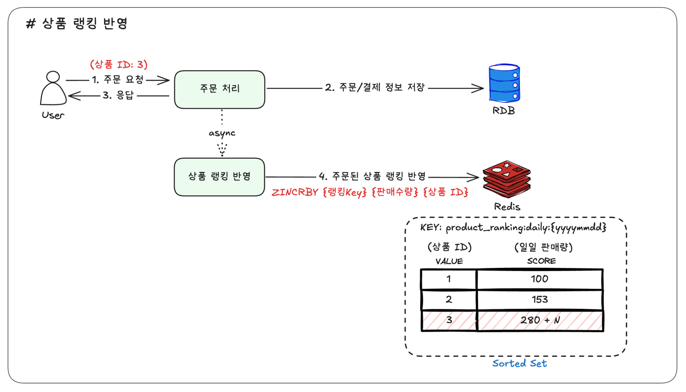
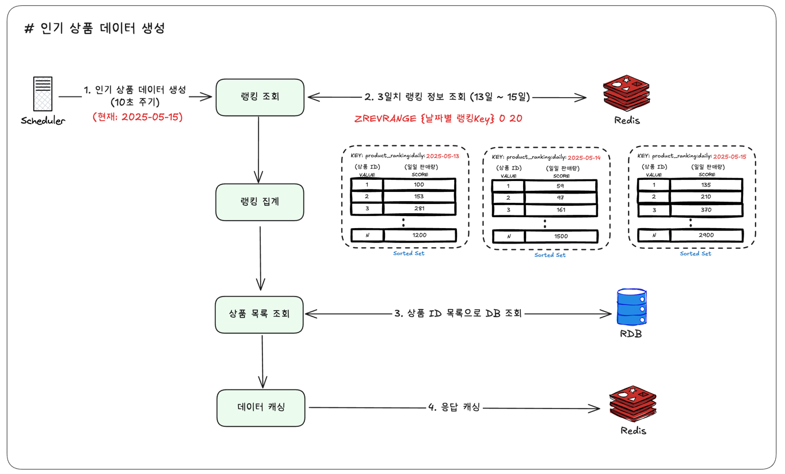
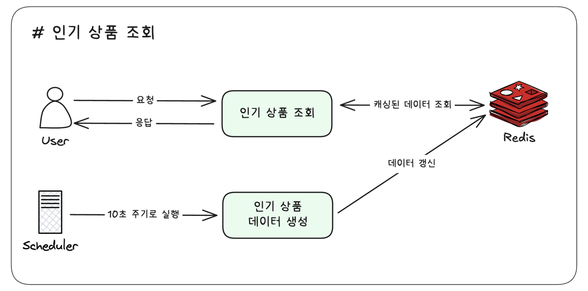
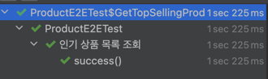

# 인기 상품 조회 개선 보고서

## 1. 목적

기존 인기 상품 조회 기능은 스케줄러를 통해 일단위로 RDB에 집계한 데이터를 기반으로 조회하는 방식으로 구성되어있습니다.
그러나 최근 실시간성이 요구되면서, 일단위로 집계된 데이터를 조회하는 방식이 아닌 실시간으로 누적된 데이터를 조회하는 방식으로 변경이 필요했습니다.

해당 보고서에서는 어떻게 실시간으로 데이터를 쌓고 조회할 수 있는지에 대한 설계와 그로인해 변화된 결과를 다루고 있습니다.

## 2. 설계
### 0) 요구사항
- 최근 3일 동안 판매된 상품을 기준으로 인기 상품을 조회할 수 있어야 합니다.
- 실시간으로 누적된 데이터를 조회할 수 있어야 합니다.

### 1) 상품 랭킹 반영

**단계별 설명**

1. **주문 API 요청**: 고객이 상품을 주문을 요청하고 결제 완료 후, 주문 처리 시스템에서 주문 완료 이벤트가 발생합니다.
    - **주문 처리 시스템**: 결제 시스템과 연동되어 주문을 처리하는 시스템
    - **이벤트 발행**: 주문 완료 시, 해당 상품의 판매량을 업데이트하기 위한 이벤트를 발행합니다.
2. **주문 처리**: 고객이 상품을 주문하면, RDB에 주문 정보를 저장후 주문 완료 이벤트를 발행합니다.
    - **RDB 저장**: 주문 정보를 RDB에 저장합니다.
    - **이벤트 발행**: 주문 완료 후, Spring Event를 사용하여 주문 완료 이벤트를 발행합니다.
3. **주문 API 응답**: 주문 처리 후, 클라이언트에 응답합니다.
4. **랭킹 데이터 업데이트**: 이벤트 수신 시, Redis Sorted Set에 해당 상품의 판매량을 실시간으로 업데이트합니다.
    - **Key**: `product_ranking:daily:{yyyymmdd}` (예: `product_ranking:daily:20250515`)
    - **Score**: 해당 날짜의 누적 판매 수량 (주문 시마다 1씩 증가)
    - **Member**: 상품 ID
    - **Redis 명령어 예시**: `ZINCRBY product_ranking:daily:20250515 1 "123"`
    - **TTL (Time To Live)**: 3일 (최근 3일간의 데이터만 유지)

### 2) 인기 상품 데이터 생성

**단계별 설명**

1.  **스케줄러 실행**: 10초 간격으로 백그라운드 스케줄러가 동작합니다.
2.  **최근 3일 데이터 집계**: 스케줄러는 현재 날짜 기준으로 최근 3일간의 상품 랭킹 데이터(예: `product_ranking:daily:오늘`, `product_ranking:daily:어제`, `product_ranking:daily:그제`)를 Redis에서 조회합니다.
3.  **랭킹 통합 및 정렬**: 각 일자별 상위 N개 상품을 가져와 판매량을 합산하고, 총 판매량 기준으로 다시 정렬하여 최종 인기 상품 목록을 만듭니다.
4.  **상품 정보 결합**: 생성된 인기 상품 ID 목록을 기반으로 RDB 또는 상품 정보 캐시에서 각 상품의 상세 정보(이름, 가격, 이미지 URL 등)를 조회하여 결합합니다.
5.  **Redis 캐시 저장**: 최종적으로 완성된 인기 상품 목록 데이터를 별도의 Redis Key에 저장합니다.
    - **Key 예시**: `popular_products:top100`
    - **데이터 형식**: JSON 배열 (상품 정보 포함)
    - **캐시 TTL (Time To Live)**: 10초 (스케줄러 실행 주기와 동일하게 설정하여 데이터 정합성 유지)

### 3) 인기 상품 조회

**단계별 설명**
1. **인기 상품 조회 요청**: 클라이언트에서 인기 상품 조회 API를 호출합니다.
2. **Redis 캐시 조회**: 서버는 Redis에서 인기 상품 목록을 조회합니다.
3. **조회 응답**: Redis에서 조회된 인기 상품 목록을 클라이언트에 응답합니다.
- **데이터 갱신**: 스케줄러를 통해 10초주기로 인기 상품 데이터를 갱신합니다.

## 3. 구현 결과

### 1) 테스트

RDB 방식에서 Redis 방식으로 변경되었어도 동일하게 테스트를 통과하였습니다.

### 2) 성과

#### 1️⃣ 실시간성 향상

- **기존**: 일단위로 집계된 데이터로 인해 실시간성이 떨어졌습니다.
- **개선 후**: 10초 단위로 실시간으로 누적된 데이터를 조회할 수 있게 되었습니다.
- **결과**: 실시간으로 반영된 데이터를 기반으로 인기 상품을 조회할 수 있게 되었습니다.

#### 2️⃣ 성능 개선

- **기존**: RDB에서 일일 배치 작업을 통해 데이터 집계
- **개선 후**: Redis에서 실시간으로 집계
- **결과**: RDB에 부하를 줄이고, Redis를 활용하여 빠른 응답 속도를 달성했습니다.

## 4. 마치며
기존 인기 상품 조회 기능은 일단위로 집계된 데이터를 기반으로 조회하는 방식으로 구성되어 있었으나, 실시간성이 요구됨에 따라 Redis를 활용한 실시간 데이터 집계 및 조회 방식으로 개선되었습니다. 이를 통해 실시간으로 누적된 데이터를 조회할 수 있게 되었습니다.

추후 개선 사항으로는 일간/주간 통계 데이터 집계 및 분석 기능을 추가및 Redis 클러스터링과 가용성 확보를 위한 백업 및 복구 전략을 고려할 수 있습니다.

