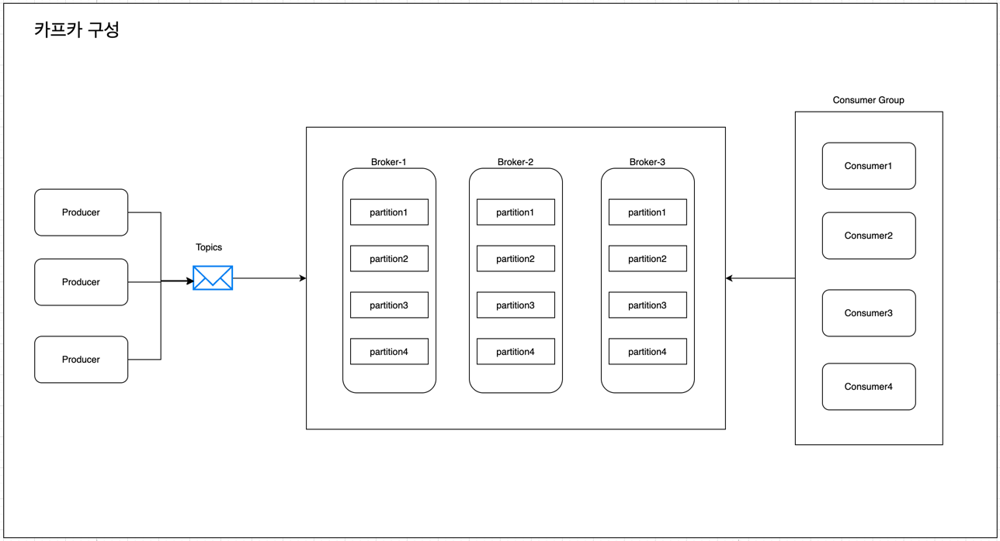
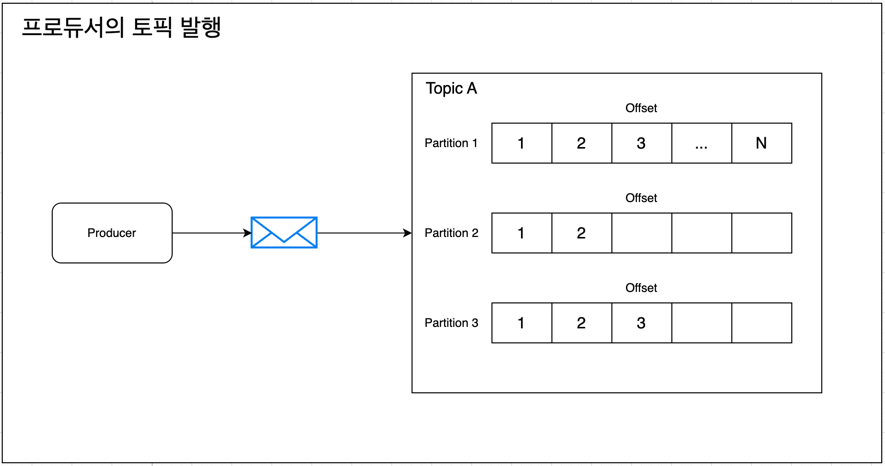
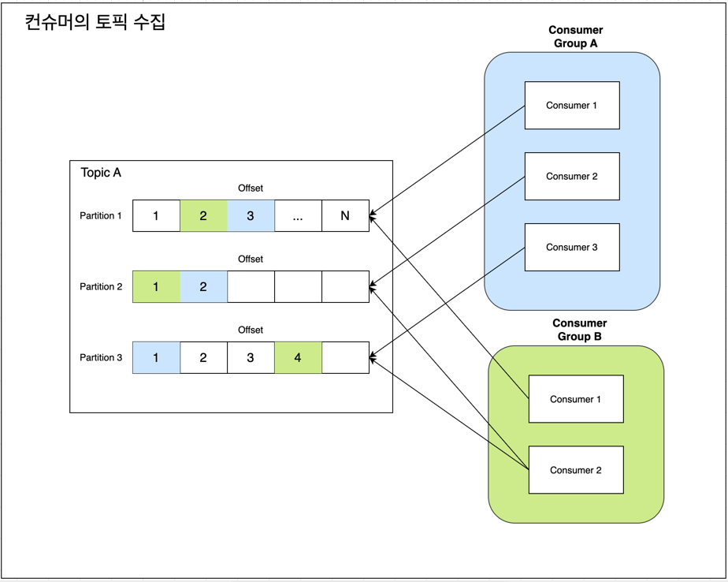

# 카프카 학습 문서

## 1. 카프카란?

Apache Kafka는 대용량의 실시간 데이터를 처리하기 위한 분산형 이벤트 스트리밍 플랫폼입니다. LinkedIn에서 개발되어 현재는 Apache Software Foundation에서 관리되고 있으며, 실시간 로그 수집, 데이터 파이프라인 구축, 이벤트 기반 아키텍처 등 다양한 분야에서 활용됩니다. Kafka는 발행-구독(publish-subscribe) 모델을 기반으로 하며, 높은 처리량과 확장성을 제공합니다.

## 2. 카프카의 구성 요소

Kafka는 다음과 같은 주요 구성 요소로 이루어져 있습니다.

- **브로커(Broker)**: Kafka 서버로, 메시지를 저장하고 관리합니다.
- **토픽(Topic)**: 메시지를 분류하는 논리적 단위입니다.
- **파티션(Partition)**: 토픽을 분할하여 병렬 처리를 가능하게 합니다.
- **프로듀서(Producer)**: 메시지를 생성하여 Kafka에 전송합니다.
- **컨슈머(Consumer)**: Kafka로부터 메시지를 읽어옵니다.
- **컨슈머 그룹(Consumer Group)**: 여러 컨슈머가 협력하여 메시지를 처리하는 단위입니다.

## 3. 브로커

### 1️⃣ 브로커의 정의

- **Kafka 서버 인스턴스**: 브로커는 Kafka 클러스터를 구성하는 개별 서버 프로세스입니다. 일반적으로 하나의 물리·가상 머신에서 하나의 브로커가 실행됩니다.
- **토픽 파티션의 저장소**: 브로커는 토픽(topic)의 파티션(partition) 단위로 메시지를 디스크에 로그(log) 형태로 저장합니다.

### 2️⃣ 주요 역할

1. **프로듀서(Producer)로부터 메시지 수신**: 프로듀서는 지정된 토픽의 파티션으로 메시지를 전송하고, 브로커는 이를 순차적으로 로그에 기록합니다.
2. **컨슈머(Consumer)로 메시지 제공**: 컨슈머는 브로커에 오프셋(offset)을 전달해 특정 위치부터 메시지를 읽어 옵니다.
3. **파티션 복제(Replication)**: 가용성과 내결함성을 위해 여러 브로커에 파티션을 복제합니다. 리더(leader) 브로커가 쓰기·읽기 요청을 처리하고, 팔로워(follower) 브로커들이 이를 복제합니다.
4. **클러스터 메타데이터 관리**: 클러스터 내 파티션의 리더 선출, 복제 상태, 브로커 간 통신 등 메타데이터를 관리합니다. 기존에는 ZooKeeper가, 최신 Kafka(KRaft 모드)에서는 내장 컨트롤러가 이 역할을 수행합니다.

## 4. 프로듀서 & 오프셋

### 1️⃣ 프로듀서의 정의

- **메시지 발행자**: 프로듀서는 Kafka 클러스터에 메시지(레코드)를 생성하고 전송하는 클라이언트 애플리케이션입니다.
- **데이터 소스**: 다양한 데이터 소스(웹 애플리케이션, 로그 시스템, IoT 디바이스 등)에서 생성된 데이터를 Kafka로 전송하는 역할을 합니다.

### 2️⃣ 토픽 발행 과정

위 이미지에서 보는 바와 같이, 프로듀서는 다음과 같은 과정을 통해 메시지를 발행합니다

1. **토픽 선택**: 프로듀서는 메시지를 발행할 토픽(Topic A)을 지정합니다.
2. **파티션 분산**: 토픽 내의 여러 파티션(Partition 1, 2, 3) 중 하나를 선택하여 메시지를 전송합니다.
3. **순차적 저장**: 각 파티션 내에서 메시지는 순차적으로 저장되며, 고유한 오프셋 번호가 할당됩니다.

### 3️⃣ 파티션 선택 전략

- **라운드 로빈**: 파티션에 순차적으로 메시지를 분산 배치
- **키 기반 해싱**: 메시지 키의 해시값을 기반으로 특정 파티션에 할당
- **커스텀 파티셔너**: 사용자 정의 로직에 따른 파티션 선택

### 4️⃣ 오프셋(Offset)의 개념

- **순차적 식별자**: 오프셋은 각 파티션 내에서 메시지의 위치를 나타내는 0부터 시작하는 순차적인 숫자입니다.
- **파티션별 독립성**: 각 파티션은 독립적인 오프셋 시퀀스를 가지며, 파티션 1의 오프셋 2와 파티션 2의 오프셋 2는 서로 다른 메시지입니다.
- **불변성**: 한 번 할당된 오프셋은 변경되지 않으며, 메시지는 삭제되더라도 오프셋은 재사용되지 않습니다.

### 5️⃣ 순서 보장

- **파티션 내 순서**: 같은 파티션 내에서는 메시지의 순서가 보장됩니다(오프셋 순서대로).
- **토픽 전체 순서**: 토픽 전체에서는 순서가 보장되지 않으며, 순서가 중요한 경우 파티션 수를 1개로 설정하거나 메시지 키를 활용해야 합니다.

## 5. 컨슈머 & 컨슈머 그룹

### 1️⃣ 컨슈머의 정의

- **메시지 소비자**: 컨슈머는 Kafka 토픽으로부터 메시지(레코드)를 읽어오는 클라이언트 애플리케이션입니다.
- **데이터 처리기**: 수신한 메시지를 실시간으로 처리하거나 다른 시스템으로 전달하는 역할을 합니다.

### 2️⃣ 토픽 수집 과정

위 이미지에서 보는 바와 같이, 컨슈머는 다음과 같은 과정을 통해 메시지를 수집합니다

1. **토픽 구독**: 컨슈머는 특정 토픽(Topic A)을 구독합니다.
2. **파티션 할당**: 컨슈머 그룹 내에서 각 컨슈머는 하나 이상의 파티션을 할당받습니다.
3. **오프셋 기반 읽기**: 각 파티션에서 마지막으로 읽은 오프셋 위치부터 순차적으로 메시지를 읽어옵니다.

### 3️⃣ 컨슈머 그룹(Consumer Group)의 개념

- **협력적 소비**: 여러 컨슈머가 하나의 그룹을 형성하여 토픽의 메시지를 분산 처리합니다.
- **독립적 처리**: 각 컨슈머 그룹은 독립적으로 토픽을 소비하며, 동일한 메시지를 여러 그룹이 각각 처리할 수 있습니다.

### 4️⃣ 파티션 할당 전략

1. **파티션별 단일 컨슈머**: 같은 컨슈머 그룹 내에서 하나의 파티션은 오직 하나의 컨슈머만 할당받습니다.
2. **자동 리밸런싱**: 컨슈머가 추가되거나 제거되면 파티션이 자동으로 재할당됩니다.
3. **병렬 처리**: 파티션 수만큼 병렬로 메시지를 처리할 수 있습니다.

> (파티션 > 컨슈머): 파티션 수가 컨슈머 수보다 많을 경우, 일부 컨슈머는 여러 파티션을 할당받습니다.  
> (파티션 < 컨슈머): 파티션 수가 컨슈머 수보다 적을 경우, 일부 컨슈머는 할당받지 않습니다.

### 5️⃣ 오프셋 관리

- **그룹별 오프셋**: 각 컨슈머 그룹은 독립적인 오프셋을 관리합니다.
- **커밋(Commit)**: 처리 완료된 메시지의 오프셋을 Kafka에 저장하여 재시작 시 이어서 처리할 수 있습니다.
- **At-least-once 보장**: 장애 상황에서도 메시지 손실 없이 최소 한 번은 처리됩니다.

### 6️⃣ 확장성과 가용성

- **수평 확장**: 컨슈머를 추가하여 처리 성능을 향상시킬 수 있습니다(최대 파티션 수까지)
- **장애 복구**: 컨슈머 장애 시 다른 컨슈머가 해당 파티션을 자동으로 인계받습니다.

## 6. 리밸런싱

### 1️⃣ 리밸런싱의 정의

- **파티션 재할당**: 리밸런싱은 컨슈머 그룹 내에서 컨슈머와 파티션 간의 할당을 다시 조정하는 과정입니다.
- **동적 조정**: 컨슈머 그룹의 구성원 변화나 토픽 변경에 따라 자동으로 발생하는 메커니즘입니다.

### 2️⃣ 리밸런싱 발생 조건

1. **컨슈머 추가**: 새로운 컨슈머가 그룹에 참여할 때
2. **컨슈머 제거**: 컨슈머가 그룹에서 탈퇴하거나 장애로 인해 제거될 때
3. **컨슈머 장애**: HeartBeat timeout으로 인한 컨슈머 실패 감지
4. **파티션 추가**: 구독 중인 토픽에 새로운 파티션이 추가될 때

### 3️⃣ HeartBeat

HeartBeat는 컨슈머가 Group Coordinator에게 주기적으로 전송하는 생존 신호입니다. 이를 통해 컨슈머가 정상적으로 동작하고 있음을 알리고, 컨슈머 그룹의 멤버십을 유지합니다.

#### (HeartBeat의 역할)

- **생존 신호**: 컨슈머가 정상적으로 동작하고 있음을 Group Coordinator에게 알립니다.
- **장애 감지**: 일정 시간 내에 HeartBeat을 받지 못하면 해당 컨슈머를 장애로 판단합니다.
- **그룹 관리**: 컨슈머 그룹의 멤버십을 관리하는 핵심 메커니즘입니다.

#### (주요 설정값)

- **`heartbeat.interval.ms`**: HeartBeat 전송 간격 (기본값: 3초)
- **`session.timeout.ms`**: 세션 타임아웃 (기본값: 30초)
- **`max.poll.interval.ms`**: poll() 호출 간 최대 간격 (기본값: 5분)

### 4️⃣ 리밸런싱 과정

1. **그룹 멤버 변화 감지**: Group Coordinator가 멤버 변화를 감지합니다.
2. **리밸런싱 시작 알림**: 모든 컨슈머에게 리밸런싱 시작을 통보합니다.
3. **현재 할당 해제**: 모든 컨슈머가 현재 할당된 파티션을 해제합니다.
4. **새로운 할당 계산**: 파티션 할당 전략에 따라 새로운 할당을 계산합니다.
5. **할당 적용**: 새로운 파티션 할당을 각 컨슈머에게 전달합니다.
6. **처리 재개**: 컨슈머들이 새로운 파티션에서 메시지 처리를 재개합니다.

### 5️⃣ 리밸런싱의 영향

#### (긍정적 효과)

- **자동 복구**: 장애 발생 시 자동으로 파티션이 재할당됩니다.
- **동적 확장**: 처리량 증가에 따른 컨슈머 추가가 자동으로 반영됩니다.
- **부하 분산**: 컨슈머 간 작업 부하를 균등하게 분산합니다.

#### (부정적 효과)

- **처리 중단**: 리밸런싱 중에는 메시지 처리가 일시 중단됩니다.
- **중복 처리**: 커밋되지 않은 메시지의 중복 처리 가능성이 있습니다.
- **지연 발생**: 대규모 그룹에서는 리밸런싱 시간이 오래 걸릴 수 있습니다.

