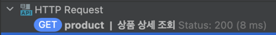

# 캐싱을 통한 조회 성능 개선 보고서

## 1. 배경

서비스내에 조회 기능중 자주 사용되거나, 조회 속도가 느린 기능이 존재합니다. 이러한 기능들은 사용자 경험을 저하시킬 수 있으며, 데이터베이스에 불필요한 부하를 줄 수 있습니다.
예를 들어, 트래픽이 많은 메인 홈에서 사용되는 데이터가 매번 데이터베이스에 접근하여 이루어진다면, 이는 성능 저하로 이어질 수 있습니다.
이러한 문제를 해결하기 위해 캐싱을 도입하여 조회 성능을 개선하고자 합니다. 캐싱을 통해 데이터베이스에 대한 부하를 줄이고, 사용자에게 더 빠른 응답을 제공하는게 목표입니다.

## 2. 기능 선정

본 보고서에서는 다음과 같은 기능을 캐싱 대상으로 선정하였습니다. 각 기능은 사용 빈도, 데이터 변경 주기, 성능 개선 효과 등을 종합적으로 고려하여 선정되었습니다.

**1️⃣ 인기 상품 조회**

- **선정 이유**: 메인 페이지 등 주요 화면에 노출되어 호출 빈도가 매우 높습니다. 데이터는 실시간 집계보다는 일정 주기로 갱신되어 캐싱에 적합합니다. 캐싱을 통해 DB 부하를 크게 줄이고 사용자에게 빠른 상품 목록을 제공할 수 있습니다.

**2️⃣ 상품 상세 조회**

- **선정 이유**: 사용자들이 구매 결정 전 반복적으로 조회하는 경향이 있습니다. 상품 정보(설명, 이미지 등)는 자주 변경되지 않으므로 캐싱 효율이 높습니다. 캐싱을 통해 개별 상품 페이지의 응답 속도를 향상시켜 사용자 경험을 개선합니다.

**3️⃣ 쿠폰 상세 조회**

- **선정 이유**: 사용 가능한 쿠폰 확인을 위해 자주 조회되며, 특정 프로모션 기간에는 트래픽이 집중될 수 있습니다. 쿠폰 정보는 발급 이후 상태 변경 전까지 유지되므로 캐싱에 유리합니다.

## 3. 캐싱 적용

### 3.1. 캐싱 기술 및 저장소 선정

본 프로젝트에서는 Spring Cache의 편리한 프로그래밍 모델과 Redis의 강력한 성능 및 분산 환경 지원을 결합하여, 애플리케이션 레벨에서는 캐싱 로직을 간결하게 관리하고 실제 캐시 데이터는 고성능 분산 캐시 시스템인 Redis에 저장함으로써 성능과 확장성을 동시에 확보하고자 합니다.

- **Spring Cache**

  - **간편한 적용**: `@Cacheable`, `@CachePut`, `@CacheEvict` 등의 애노테이션을 사용하여 기존 코드 변경을 최소화하고 선언적으로 캐싱 로직을 적용할 수 있습니다.
  - **추상화**: 캐시 구현 기술에 대한 의존성을 낮춰 코드를 깔끔하게 유지할 수 있으며, 필요에 따라 캐시 저장소를 쉽게 변경할 수 있습니다.
  - **AOP 기반**: Aspect-Oriented Programming(AOP)을 통해 비즈니스 로직과 캐싱 로직을 분리하여 코드의 가독성과 유지보수성을 향상시킵니다.

- **Redis**:
  - **고성능**: In-memory 데이터 저장소로서 매우 빠른 읽기/쓰기 속도를 제공하여 캐싱 시스템의 응답 시간을 단축시킵니다.
  - **다양한 데이터 구조 지원**: String, Hash, List, Set, Sorted Set 등 다양한 데이터 타입을 지원하여 복잡한 캐싱 시나리오에도 효과적으로 대응할 수 있습니다.
  - **분산 캐시 환경 지원**: 여러 애플리케이션 서버가 동일한 캐시 데이터에 접근할 수 있도록 지원하여 시스템 확장성을 높이고, 대규모 트래픽 처리에 유리합니다.
  - **데이터 영속성 옵션**: 스냅샷 또는 AOF(Append Only File) 방식을 통해 데이터를 디스크에 저장하여 장애 발생 시 데이터 유실 위험을 줄일 수 있습니다.

### 3.2. 기능별 도입

**1️⃣ 인기 상품 조회**

- **읽기 전략**: `@Cacheable`을 활용한 Cache Aside 패턴을 적용

```java
@Cacheable(value = CacheNames.TOP_SELLING_PRODUCTS, key = "'limit-' + #limit")
public List<ProductVo> findTopSellingProducts(int limit) {
```

- **만료 시간**: 25시간
- **쓰기 전략**: 인기 상품 갱신시(24시간마다) 캐시를 갱신

```java
@CachePut(value = CacheNames.TOP_SELLING_PRODUCTS, key = "'limit-' + #limit")
public List<ProductVo> refreshTopSellingProducts(int limit) {
```

> 만료 시간은 25시간으로 두어 쓰기 실패에 의한 캐시 유실을 방지하고, 캐시 갱신 주기를 24시간으로 설정하여 매일 자정에 캐시를 갱신하도록 하였습니다.

**2️⃣ 상품 상세 조회**

- **읽기 전략**: `@Cacheable`을 활용한 Cache Aside 패턴을 적용

```java
@Cacheable(value = CacheNames.PRODUCT_DETAILS, key = "#productId")
public ProductVo findById(long productId) {
```

- **만료 시간**: 1시간
- **쓰기 전략**: 상품 정보 변경시 캐시를 갱신

```java
option.deductStock(item.quantity());
productOptionRepository.save(option);
cacheTemplate.evictAsync(CacheNames.PRODUCT_DETAILS + "::" + option.productId());
```

> 현재는 상품 변경 기능이 존재하지않아 재고 차감 기능에만 캐시 evict을 추가해두었습니다. 추후 상품 변경 기능이 추가되면 `@CachePut`을 활용하여 캐시를 갱신할 예정입니다.

**3️⃣ 쿠폰 상세 조회**

- **읽기 전략**: `@Cacheable`을 활용한 Cache Aside 패턴을 적용

```java
@Cacheable(value = CacheNames.COUPON_DETAILS, key = "#id")
public CouponVo getCouponDetail(long id) {
```

- **만료 시간**: 1시간
- **쓰기 전략**: 쿠폰 정보 변경시 캐시를 갱신

```java
@CacheEvict(value = CacheNames.COUPON_DETAILS, key = "#command.couponId")
public IssuedCouponVo issue(CouponCommand.Issue command) {
```

> 현재는 쿠폰 변경 기능이 존재하지않아 쿠폰 발급 기능에만 캐시 evict을 추가해두었습니다. 추후 쿠폰 변경 기능이 추가되면 `@CachePut`을 활용하여 캐시를 갱신할 예정입니다.

## 4. 결과 분석

**1️⃣ 인기 상품 조회**

 

- **응답 속도**: 캐싱전 114ms, 캐싱 후: 20ms
- **결과**: 응답속도 82% 개선

**2️⃣ 상품 상세 조회**

 

- **응답 속도**: 캐싱전 59ms, 캐싱 후: 8ms
- **결과**: 응답속도 86% 개선

**3️⃣ 쿠폰 상세 조회**

 

- **응답 속도**: 캐싱전 49ms, 캐싱 후: 8ms
- **결과**: 응답속도 84% 개선

## 5. 한계 및 대안

**1️⃣ 캐시 스탬피드 현상**

- **설명**: 특정 캐시 데이터가 동시에 만료되어 다수 요청이 DB로 한꺼번에 몰리는 현상. 시스템 과부하 및 일시적 장애 유발 가능.
- **대안: 캐시 워밍 (Cache Warming)**
  - 시스템 시작 또는 데이터 만료 전, 미리 캐시에 데이터를 적재
  - 사용자 요청 시 캐시 미스 최소화 및 DB 부하 집중 방지
  - 예시: 애플리케이션 배포 시점 또는 백그라운드 작업을 통해 주기적 갱신

**2️⃣`@Cacheable`의 한계**

- **설명**: 외부 캐시 저장소(예: Redis) 장애 시 `@Cacheable` 적용 메서드에서 예외 발생. 캐시 의존도가 높은 기능은 일시적 중단 가능.
- **대안**:
  1.  **서킷 브레이커 (Circuit Breaker) 패턴 적용**:
      - Redis 등 외부 시스템 호출에 서킷 브레이커 구현 (예: Resilience4j)
      - 장애 시 DB 직접 조회 등 폴백(fallback) 로직 실행
  2.  **캐시 작업 타임아웃(Timeout) 설정**:
      - Redis 클라이언트에 연결 및 읽기/쓰기 타임아웃 설정
      - 애플리케이션 스레드의 무한 대기 방지
  3.  **예외 처리 및 로깅 강화**:
      - 캐시 작업 예외를 적절히 처리하고 상세 로그 기록
      - 장애 상황 신속 인지 및 분석 지원
  4.  **다중 캐시 또는 로컬 캐시 활용**:
      - 중요 데이터는 분산 캐시 외 로컬 인메모리 캐시(2차 캐시) 활용 고려
      - Redis 장애 시 2차 캐시 또는 로컬 기본값으로 최소 서비스 유지

## 6. 마치며

캐싱 도입은 주요 조회 기능의 응답 속도를 평균 80% 이상 개선하고 DB 부하를 줄여, 시스템 성능과 사용자 경험 향상에 기여했습니다. Spring Cache와 Redis 조합은 개발 편의성과 고성능을 제공했지만, 캐시 스탬피드 및 외부 저장소 장애 가능성을 인지하고 캐시 워밍, 서킷 브레이커 등으로 대비해야 합니다.
