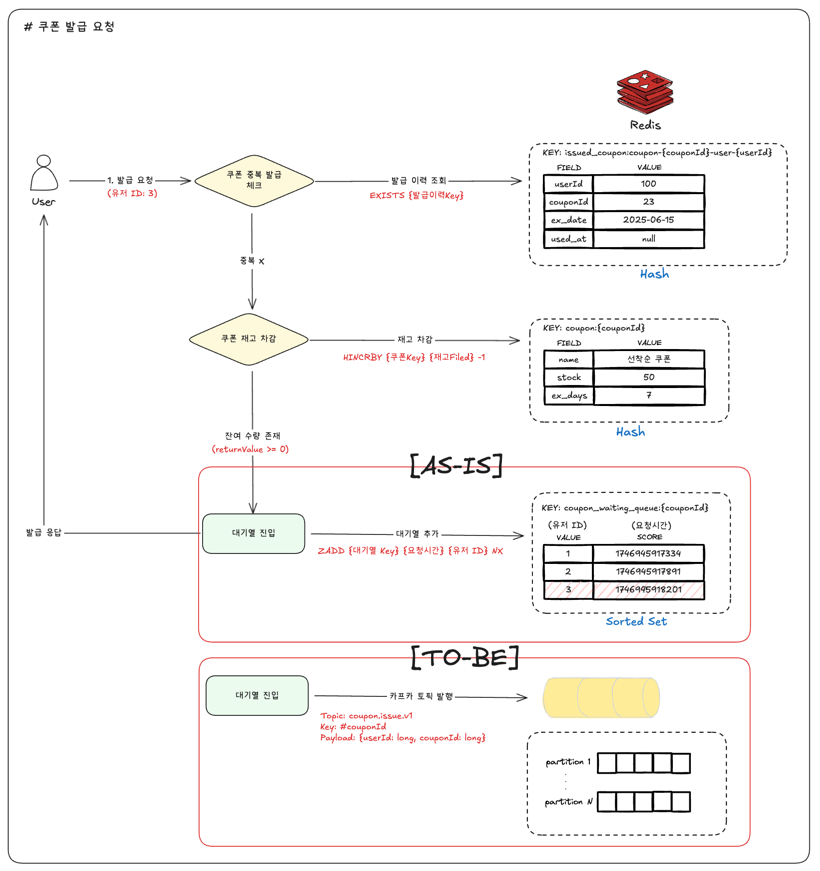
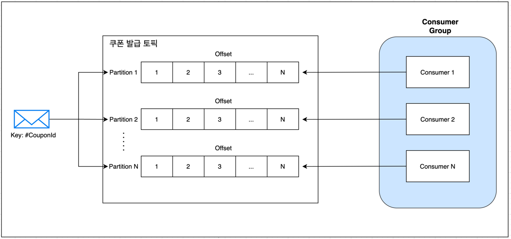
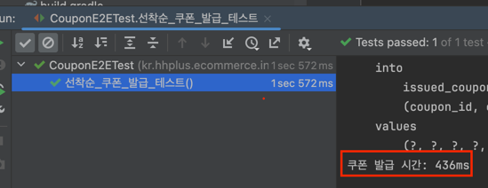

# 쿠폰 발급 카프카 개선 보고서

## 배경
기존 쿠폰 발급은 레디스를 활용해 원자성이 보장되고 DB에 부하가 가지 않는 방식으로 구현되어있습니다.
이번 보고서에서는 쿠폰 발급 요청시 스케줄러를 통해 주기적으로 발급해주던 로직을 카프카로 교체해 빠른 처리와 기존과 동일하게 순서가 보장되도록 개선하고자 합니다.

## 개선안

### 1️⃣ 대기열 기능 변경점


기존 설계에서는 순서 보장을 위해 SortedSet 자료구조를 사용하여 유저 ID와 요청 시간을 기준으로 정렬된 대기열을 유지했습니다.
변경된 설계에서는 카프카 토픽을 발행하여 카프카의 순서 보장 기능을 활용합니다.

### 2️⃣ 쿠폰 발급 처리 변경점

기존 설계에서는 스케줄러가 대기열 SortedSet을 모두 확인하여 발급할 쿠폰이 있는 대기열을 불러와 대기열에 있는 아이템을 추출해 chunk 단위로 발급을 처리했습니다.

변경된 설계에서는 카프카 컨슈머가 대기열 토픽을 구독하고, 발급 요청 메시지를 순차적으로 처리합니다. 이를 통해 스케줄러의 주기적 실행 없이도 실시간으로 쿠폰 발급 요청을 처리할 수 있습니다.

또한 카프카의 파티션 기능을 통해 특정 쿠폰 ID에 대한 발급 요청을 동일한 파티션으로 보내어 순서를 보장합니다. 이를 통해 대기열의 순서 보장과 발급 처리를 동시에 해결할 수 있습니다.

## 구현
### 1️⃣ 프로듀서
```java
// 쿠폰 발급 서비스 로직
public void requestIssuance(CouponCommand.RequestIssuance command) {
    // ....
    // 중복 쿠폰 & 쿠폰 수량 체크

    CouponIssuanceRequest request = new CouponIssuanceRequest(
        command.userId(),
        command.couponId(),
        command.requestTimeMillis()
    );
    // AS-IS -> couponIssuanceRequestRepository.save(request);
    couponIssuanceRequestPublisher.publish(request);
}

// 쿠폰 발급 요청을 카프카로 발행하는 프로듀서
@Component
@RequiredArgsConstructor
public class CouponIssuanceRequestKafkaPublisher implements CouponIssuanceRequestPublisher {
    private final KafkaTemplate<String, String> kafkaTemplate;

    @Override
    public void publish(CouponIssuanceRequest request) {
        String partitionKey = String.valueOf(request.couponId());

        kafkaTemplate.send(
            Topics.ISSUE_COUPON,
            partitionKey,
            JsonUtils.stringify(request)
        );
    }
}
```

기존에 CouponIssuanceRequestRepository 통해 SortedSet에 순서대로 저장되던 발급 요청을 카프카 토픽 발행으로 변경합니다.
`KafkaTemplate`을 사용하여 쿠폰 발급 요청 메시지를 카프카 토픽에 발행합니다. 이때, 쿠폰 ID를 파티션 키로 사용하여 동일한 쿠폰 ID에 대한 요청이 동일한 파티션으로 전송되도록 합니다.

### 2️⃣ 컨슈머
```java
@RetryableTopic(
    attempts = "3",
    backoff = @Backoff(delay = 1000, multiplier = 2.0),
    dltTopicSuffix = Topics.ISSUE_COUPON + ".dlt"
)
@KafkaListener(
    topics = Topics.ISSUE_COUPON,
    groupId = "coupon"
)
public void handleIssueCouponEvent(@Payload IssueCouponPayload.Issue payload) {
    ...
    issuedCouponService.issue(command);
}
```
카프카 컨슈머는 `@KafkaListener` 어노테이션을 사용하여 특정 토픽을 구독하고, 발급 요청 메시지를 처리합니다. `@RetryableTopic` 어노테이션을 통해 실패 시 재시도 로직을 추가하고, 최종적으로 실패한 메시지는 Dead Letter Topic(DLT)으로 전송됩니다.

#### DLT 처리

```java
@KafkaListener(
    topics = Topics.ISSUE_COUPON + ".dlt",
    groupId = "coupon"
)
public void handleDeadLetterTopic(@Payload IssueCouponPayload.Issue payload)  {
    log.error("Failed to process DLT message payload: {}", payload);
}
```


## 결과
기존에 주기적으로 N초 마다 발급을 처리하던 방식에서 카프카를 활용하여 실시간으로 발급 요청을 처리할 수 있게 되었습니다. 이를 통해 발급 대기 시간이 크게 단축되었습니다.

