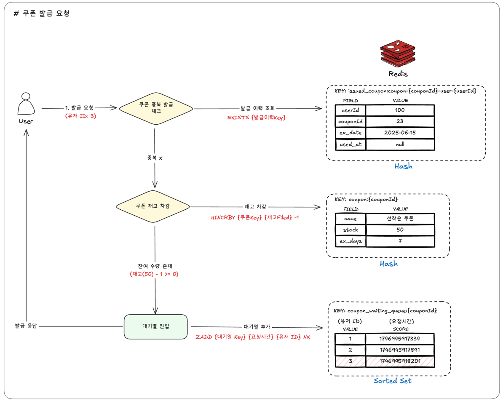
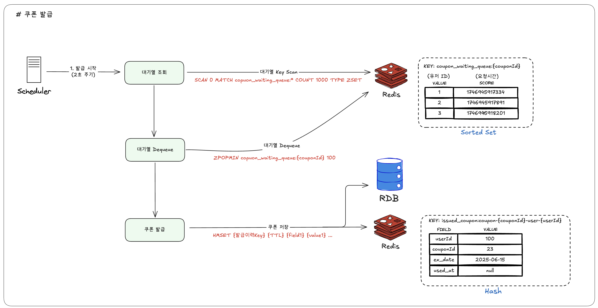
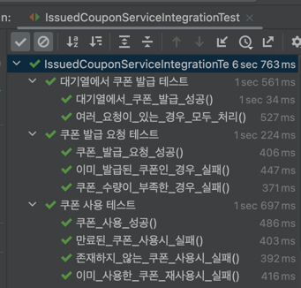

# 쿠폰 발급 시스템 개선 보고서

## 1. 목적

기존 쿠폰 발급 시스템은 특정 상황(예: 대규모 이벤트 시 동시 요청 증가)에서 성능 저하 및 응답 시간 지연 문제가 발생할 가능성이 있었습니다.
본 보고서는 이러한 문제를 해결하고, 보다 안정적이고 효율적인 쿠폰 발급 시스템을 구축하기 위한 설계 개선 방안과 그 예상 효과를 다룹니다.

## 2. 설계

### 0) 요구사항

- 대규모 트래픽 발생 시에도 안정적인 쿠폰 발급 처리가 가능해야 합니다.
- 쿠폰 발급 요청에 대한 응답 시간을 최소화해야 합니다.
- 동시성 제어가 정확하게 이루어져야 합니다.

### 1) 쿠폰 발급 요청

**단계별 설명**

1.  **사용자 요청**: 사용자가 특정 쿠폰 ID에 대해 발급을 요청합니다.
2.  **쿠폰 중복 발급 확인**: Redis의 `EXISTS` 명령어를 사용하여 사용자가 이미 해당 쿠폰을 발급받았는지 확인합니다.
    - **키 형식**: `issued_coupon:coupon:{couponId}-user:{userId}` (Hash)
    - 이 키에는 발급된 쿠폰의 상세 정보(사용자 ID, 쿠폰 ID, 만료일, 사용일시 등)가 저장됩니다.
3.  **쿠폰 재고 차감**: 중복 발급이 아닐 경우, Redis Hash에 저장된 해당 쿠폰의 재고를 `HINCRBY` 명령어로 1 감소시킵니다.
    - **키 형식**: `coupon:{couponId}` (Hash)
    - 이 키에는 쿠폰의 기본 정보(이름, 총 수량, 유효 기간 등)와 현재 `stock`(재고)이 저장됩니다.
    - 재고 차감은 원자적으로 처리되며, 재고가 0보다 클 때만 성공합니다.
4.  **대기열 진입**: 재고 차감에 성공하면, 사용자의 요청 정보를 Redis Sorted Set으로 구현된 대기열에 `ZADD` 명령어로 추가합니다.
    - **키 형식**: `coupon_waiting_queue:{couponId}` (Sorted Set)
    - **Score**: 요청 시간 (타임스탬프)을 사용하여 선착순 처리의 기준을 마련합니다.
    - **Value**: `userId`
    - `NX` 옵션 등을 활용하여 이미 대기열에 있는 사용자의 중복 추가를 방지할 수 있습니다. (이미지에는 명시되지 않았으나 일반적인 구성)
5.  **발급 요청 응답**: 사용자에게 "쿠폰 발급 요청이 정상적으로 접수되었습니다"와 같이 빠른 응답을 전달합니다. 실제 쿠폰 지급은 백그라운드에서 비동기적으로 처리됩니다.

### 2) 쿠폰 발급 처리

**단계별 설명 (스케줄러 기반)**

1.  **스케줄러 실행**: 설정된 주기(예: 2초)마다 백그라운드 스케줄러가 동작합니다.
2.  **처리 대상 대기열 스캔 (선택적)**: 스케줄러는 `SCAN` 명령어를 사용하여 `coupon_waiting_queue:*` 패턴으로 활성화된 쿠폰 대기열들을 탐색할 수 있습니다. 또는 사전에 정의된 쿠폰 ID 목록을 사용할 수도 있습니다.
3.  **대기열에서 사용자 추출 (Dequeue)**: 각 쿠폰 대기열(Sorted Set)에서 `ZPOPMAX` 명령어를 사용하여 우선순위(가장 빠른 요청 시간)가 높은 사용자들을 지정된 개수(예: 100명)만큼 추출합니다. 이 명령어는 추출과 동시에 해당 멤버를 대기열에서 제거합니다.
4.  **쿠폰 발급 및 정보 저장**: 추출된 각 사용자에 대해 실제 쿠폰 발급 로직을 수행합니다.
    - **RDB 저장**: 최종적인 쿠폰 발급 내역 (누가, 어떤 쿠폰을, 언제 발급받았는지 등)을 관계형 데이터베이스(RDB)에 기록하여 영속성을 보장합니다.
    - **Redis 발급 정보 저장**: 발급된 쿠폰의 상세 정보를 Redis Hash에 저장하여 사용자의 빠른 조회 및 사용 처리를 지원합니다.
      - **키 형식**: `issued_coupon:coupon:{couponId}-user:{userId}` (Hash)
      - **필드**: `userId`, `couponId`, `ex_date` (만료일), `used_at` (사용일시, 초기에는 null) 등
      - 이 정보는 "1) 쿠폰 발급 요청" 단계의 중복 발급 확인 시에도 사용됩니다.

## 3. 구현 결과

### 1) 테스트

RDB에서 Redis 구조로 변경되어도 기존과 존재하던 테스트코드들은 성공합니다.

### 2) 성과 (기대 효과)

#### 1️⃣ **대규모 트래픽 처리 능력 향상 및 시스템 안정성 증대**

- **기존**: 동시 요청 증가 시 RDB 병목 현상 및 재고 관리의 복잡성으로 인해 시스템 전체의 성능 저하 및 안정성 문제가 발생할 수 있었습니다. 특히, 선착순 쿠폰 발급 시 정확한 동시성 제어가 어려웠습니다.
- **개선 후**:
  - **Redis 기반 재고 관리**: `HINCRBY`와 같은 Redis의 원자적(Atomic) 연산을 활용하여 쿠폰 재고를 빠르고 정확하게 관리합니다. 이를 통해 RDB의 부하를 줄이고, 재고 차감 과정에서의 경쟁 상태(Race Condition)를 효과적으로 방지합니다.
  - **Redis Sorted Set 대기열**: 쿠폰 발급 요청을 메모리 기반의 Redis Sorted Set에 우선순위(요청 시간)대로 저장하여 공정한 선착순 처리를 보장합니다. 이는 RDB에 직접적인 쓰기 요청이 몰리는 것을 방지하고, 시스템이 처리할 수 있는 속도에 맞춰 요청을 조절하는 버퍼 역할을 수행합니다.
  - **비동기 발급 처리**: 스케줄러가 대기열에서 요청을 가져와 순차적으로 RDB에 최종 발급 정보를 기록함으로써, 사용자 요청 시점에는 빠른 응답(요청 접수 완료)을 제공하고 실제 DB 작업은 안정적으로 백그라운드에서 처리합니다.

#### 2️⃣ **사용자 응답 속도 개선 및 경험 향상**

- **기존**: 쿠폰 발급 요청 시 모든 처리(중복 확인, 재고 차감, DB 저장 등)가 동기적으로 이루어져 사용자가 결과를 받기까지 대기 시간이 길어질 수 있었습니다.
- **개선 후**: 사용자의 쿠폰 발급 요청은 Redis에서의 빠른 처리(중복 확인, 재고 확인 및 선점, 대기열 삽입) 후 즉시 응답을 받게 됩니다. 실제 쿠폰 발급 및 RDB 저장 작업은 비동기적으로 수행되므로, 사용자는 시스템 지연 없이 즉각적인 피드백을 경험할 수 있습니다.

#### 3️⃣ **선착순 이벤트의 정확성 및 신뢰도 확보**

- **기존**: 다수의 동시 요청 발생 시, 정확한 선착순 처리 및 재고 관리에 어려움이 있어 과발급 또는 발급 실패의 가능성이 있었습니다.
- **개선 후**: Redis의 싱글 스레드 기반 명령어 처리 특성과 원자적 연산을 통해 데이터 정합성을 보장합니다. 요청 시간을 기준으로 하는 Sorted Set 대기열 운영으로 선착순 발급의 공정성과 정확성을 크게 향상시켜, 사용자와 서비스 제공자 모두에게 신뢰도 높은 쿠폰 발급 환경을 제공합니다.

#### 4️⃣ **자원 활용 최적화 및 확장성 개선**

- **기존**: 피크 타임의 RDB 부하를 감당하기 위해 과도한 DB 자원 및 사양이 요구될 수 있었습니다.
- **개선 후**: 실시간성이 높고 빈번한 읽기/쓰기가 발생하는 재고 관리 및 대기열 처리를 Redis로 이전함으로써 RDB의 부하를 크게 줄입니다. 이는 RDB 자원의 효율적인 사용을 가능하게 하며, 트래픽 증가 시 Redis 클러스터링 또는 스케줄러 워커 수 조정을 통해 상대적으로 용이하게 시스템 확장이 가능합니다.

## 4. 마치며

본 보고서에서 제시된 쿠폰 발급 시스템 개선안은 Redis를 적극적으로 활용하여 대기열 관리, 재고 관리, 중복 발급 방지 등의 핵심 기능을 구현함으로써 기존 시스템의 동시성 처리 능력과 응답 속도를 혁신적으로 개선하는 데 초점을 맞추었습니다.

주요 개선 사항은 다음과 같습니다:

- **Redis Sorted Set 기반 대기열**: 쿠폰 발급 요청을 공정하게 선착순으로 처리하고, 스케줄러를 통해 안정적으로 실제 발급을 수행합니다.
- **Redis Hash 및 원자적 연산 활용**: 쿠폰 재고를 실시간으로 정확하게 관리하고, 중복 발급을 효과적으로 방지합니다.
- **비동기 처리 도입**: 사용자 요청에 대해 즉각적인 피드백을 제공하고, 실제 발급 처리는 백그라운드에서 수행하여 사용자 경험을 향상시킵니다.

이를 통해 대규모 트래픽 상황에서도 안정적인 쿠폰 발급 서비스를 제공하고, 시스템 자원을 효율적으로 사용할 수 있게 되었습니다. 또한, RDB에는 최종 발급 결과만을 저장함으로써 부하를 줄이고, 실시간성이 중요한 데이터는 Redis에서 처리하여 전반적인 시스템 성능을 최적화했습니다.
